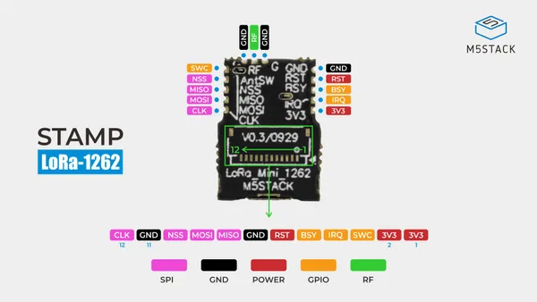
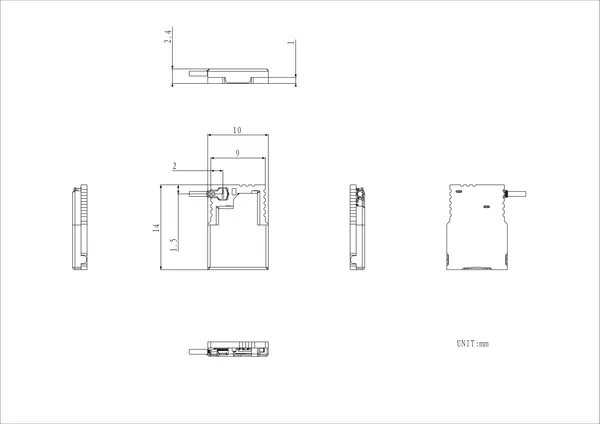
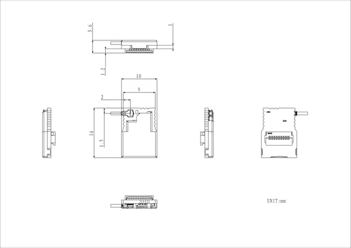
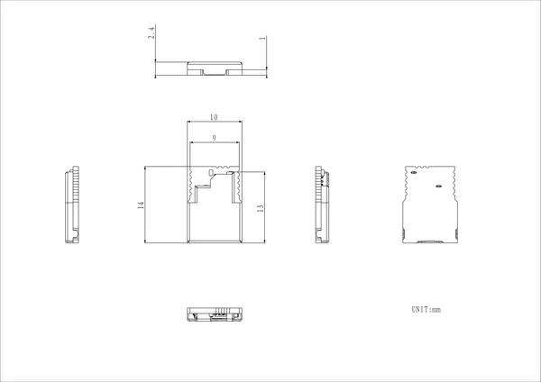

# Stamp LoRa-1262

**M5Stack** · Expansion

Revision: LoRa-1262 original variant shown  
Coverage: Pinout image collected

[Browse all manufacturers](../../../../BROWSE.md) · [Desktop app](https://github.com/valleytechsolutions/black-wire-desktop)

## Pinout

**pinout image** · Reviewed source · JPG

[Open original reference](../../../../library/media/1af7ac83d9336bb2f35bb410f4280a8b22d502613d6eac729eeb041eb7730165.jpg)

**Credit and rights:** Not established; source attribution retained. Source/manufacturer: M5Stack.

[Source 1](https://m5stack-doc.oss-cn-shenzhen.aliyuncs.com/1279/S014-pinmap.jpg) · [Source 2](https://docs.m5stack.com/en/stamp/Stamp_LoRa-1262)

Imported from existing M5Stack Board Reference; original working path preserved.

SHA-256: `1af7ac83d9336bb2f35bb410f4280a8b22d502613d6eac729eeb041eb7730165`

## Dimensions

**source reference** · Unreviewed source · PNG

[Open original reference](../../../../library/media/45e5bf0960db2334d10f14dd2a1bb1e17531bdc49ddac18688970b6ab489ba85.png)

**Credit and rights:** Source rights not yet established. Source/manufacturer: M5Stack.

[Source 1](https://m5stack-doc.oss-cn-shenzhen.aliyuncs.com/1279/S014-I_Stamp_LoRa-1262_I_model_size_page_01.png) · [Source 2](https://docs.m5stack.com/en/stamp/Stamp_LoRa-1262)

Original source index: Dimensions. This file is searchable but has not been promoted to a reviewed physical board pinout.

SHA-256: `45e5bf0960db2334d10f14dd2a1bb1e17531bdc49ddac18688970b6ab489ba85`

## Dimensions

**source reference** · Unreviewed source · PNG

[Open original reference](../../../../library/media/16c7b3463dae6256bdbf5ca33f51b99c28c9ab0f656745a751235cda4affa30e.png)

**Credit and rights:** Source rights not yet established. Source/manufacturer: M5Stack.

[Source 1](https://m5stack-doc.oss-cn-shenzhen.aliyuncs.com/1279/S014-IF_Stamp_LoRa-1262_IF_model_size_page_01.png) · [Source 2](https://docs.m5stack.com/en/stamp/Stamp_LoRa-1262)

Original source index: Dimensions. This file is searchable but has not been promoted to a reviewed physical board pinout.

SHA-256: `16c7b3463dae6256bdbf5ca33f51b99c28c9ab0f656745a751235cda4affa30e`

## Dimensions

**source reference** · Unreviewed source · PNG

[Open original reference](../../../../library/media/63079d2198867802045d8b25ab4ea08897b8e4357f63056a2f9c874a5f2eb5a7.png)

**Credit and rights:** Source rights not yet established. Source/manufacturer: M5Stack.

[Source 1](https://m5stack-doc.oss-cn-shenzhen.aliyuncs.com/1279/S014_Stamp_LoRa-1262_model_size_page_01.png) · [Source 2](https://docs.m5stack.com/en/stamp/Stamp_LoRa-1262)

Original source index: Dimensions. This file is searchable but has not been promoted to a reviewed physical board pinout.

SHA-256: `63079d2198867802045d8b25ab4ea08897b8e4357f63056a2f9c874a5f2eb5a7`

Pin assignments have not been independently electrically verified. Check board revision before wiring.
