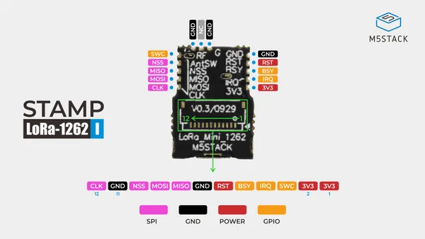

# Stamp LoRa-1262 I

**M5Stack** · Expansion

Revision: I antenna variant shown  
Coverage: Pinout image collected

[Browse all manufacturers](../../../../BROWSE.md) · [Desktop app](https://github.com/valleytechsolutions/black-wire-desktop)

## Pinout

**pinout image** · Reviewed source · JPG

[Open original reference](../../../../library/media/d5e1bb05734b0b8add0c6e16ae6e84cdeea3052e2f341941848efe35309dd1c2.jpg)

**Credit and rights:** Not established; source attribution retained. Source/manufacturer: M5Stack.

[Source 1](https://m5stack-doc.oss-cn-shenzhen.aliyuncs.com/1279/S014-I-pinmap.jpg) · [Source 2](https://docs.m5stack.com/en/stamp/Stamp_LoRa-1262)

Imported from existing M5Stack Board Reference; original working path preserved.

SHA-256: `d5e1bb05734b0b8add0c6e16ae6e84cdeea3052e2f341941848efe35309dd1c2`

Pin assignments have not been independently electrically verified. Check board revision before wiring.
