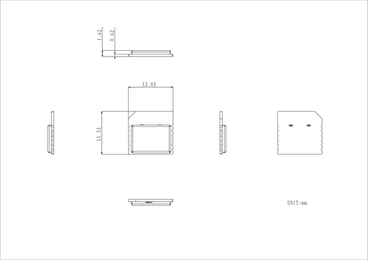

# Stamp UWB

**M5Stack** · Expansion

Revision: Not identified  
Coverage: Pinout image collected

[Browse all manufacturers](../../../../BROWSE.md) · [Desktop app](https://github.com/valleytechsolutions/black-wire-desktop)

## Pinout

**pinout image** · Reviewed source · JPG

[Open original reference](../../../../library/media/be0b15e5b9ab67dc6d9dac8c3bfb50fdaf38fb48886d656480fbb0b2969da01f.jpg)

**Credit and rights:** Not established; source attribution retained. Source/manufacturer: M5Stack.

[Source 1](https://m5stack-doc.oss-cn-shenzhen.aliyuncs.com/1262/S017_Stamp_UWB_pinmap.jpg) · [Source 2](https://docs.m5stack.com/en/stamp/Stamp_UWB)

Imported from existing M5Stack Board Reference; original working path preserved.

SHA-256: `be0b15e5b9ab67dc6d9dac8c3bfb50fdaf38fb48886d656480fbb0b2969da01f`

## Dimensions

**source reference** · Unreviewed source · PNG

[Open original reference](../../../../library/media/6ce6ec7302f4436b7a5e699aa1297df637cca5526007262fa61418251e23d441.png)

**Credit and rights:** Source rights not yet established. Source/manufacturer: M5Stack.

[Source 1](https://m5stack-doc.oss-cn-shenzhen.aliyuncs.com/1262/S017-Stamp_UWB_model_size_page_01.png) · [Source 2](https://docs.m5stack.com/en/stamp/Stamp_UWB)

Original source index: Dimensions. This file is searchable but has not been promoted to a reviewed physical board pinout.

SHA-256: `6ce6ec7302f4436b7a5e699aa1297df637cca5526007262fa61418251e23d441`

Pin assignments have not been independently electrically verified. Check board revision before wiring.
