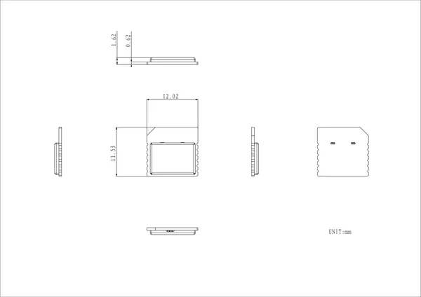
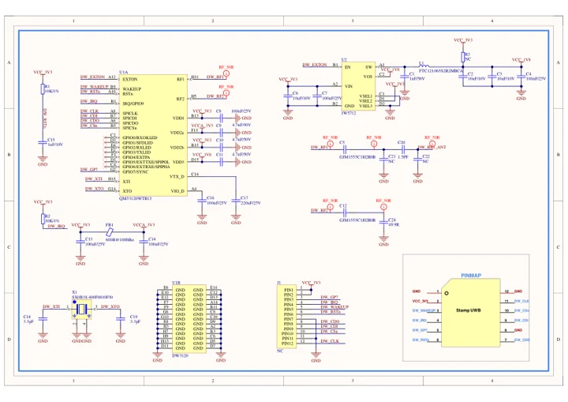

# Stamp UWB

**M5Stack** · Expansion

Revision: Not identified

Coverage: Manufacturer references reviewed by scope; independent electrical and all-connector review pending

[Browse all manufacturers](../../../../BROWSE.md) · [Devices & IoT](../../../../DEVICES.md) · [Open in the browser guide](https://valleytech-black-wire-guide.pages.dev/?board=m5stack-expansion-stamp-uwb)

## Datasheets and original documentation

Board datasheet: **not yet recorded**. Visual reference: **available**.

[Manufacturer hardware documentation](https://docs.m5stack.com/en/stamp/Stamp_UWB)

- **schematic / board**: [Stamp UWB Schematics PDF](https://m5stack-doc.oss-cn-shenzhen.aliyuncs.com/1262/SCH_UWB_MODULE_SCH_main_V0.2_20251128_2026_06_01_11_54_35.pdf) · [saved document](../../../../library/media/a2fec54b4c0285b5b2a35f3f9a06c8bbcf6cd8b17629a5def822c327f79878a8.pdf)
- **hardware-guide / board**: [Manufacturer pin and hardware documentation](https://docs.m5stack.com/en/stamp/Stamp_UWB) · online

A chip datasheet, schematic and board datasheet have different scopes. Match the exact hardware revision.

[Documentation coverage and remaining gaps](../../../../DOCUMENTATION.md)

## Pinout

**pinout image** · Reviewed source · JPG

[Open original reference](../../../../library/media/be0b15e5b9ab67dc6d9dac8c3bfb50fdaf38fb48886d656480fbb0b2969da01f.jpg)

**Credit and rights:** Not established; source attribution retained. Source/manufacturer: M5Stack.

[Source 1](https://m5stack-doc.oss-cn-shenzhen.aliyuncs.com/1262/S017_Stamp_UWB_pinmap.jpg) · [Source 2](https://docs.m5stack.com/en/stamp/Stamp_UWB)

Imported from existing M5Stack Board Reference; original working path preserved.

Image revision: Not identified

SHA-256: `be0b15e5b9ab67dc6d9dac8c3bfb50fdaf38fb48886d656480fbb0b2969da01f`

## Dimensions

**source reference** · Unreviewed source · PNG

[Open original reference](../../../../library/media/6ce6ec7302f4436b7a5e699aa1297df637cca5526007262fa61418251e23d441.png)

**Credit and rights:** Source rights not yet established. Source/manufacturer: M5Stack.

[Source 1](https://m5stack-doc.oss-cn-shenzhen.aliyuncs.com/1262/S017-Stamp_UWB_model_size_page_01.png) · [Source 2](https://docs.m5stack.com/en/stamp/Stamp_UWB)

Original source index: Dimensions. This file is searchable but has not been promoted to a reviewed physical board pinout.

Image revision: Not identified

SHA-256: `6ce6ec7302f4436b7a5e699aa1297df637cca5526007262fa61418251e23d441`

## Stamp UWB Schematics PDF

**original reference PDF** · Manufacturer source and first-page preview inspected; electrical correctness and all-connector completeness not independently approved. · PDF

[Open original reference](../../../../library/media/a2fec54b4c0285b5b2a35f3f9a06c8bbcf6cd8b17629a5def822c327f79878a8.pdf)

**Credit and rights:** Manufacturer artwork; reuse and print rights not established. Inclusion does not relicense the original.. Source/manufacturer: M5Stack.

[Source 1](https://m5stack-doc.oss-cn-shenzhen.aliyuncs.com/1262/SCH_UWB_MODULE_SCH_main_V0.2_20251128_2026_06_01_11_54_35.pdf) · [Source 2](https://docs.m5stack.com/en/stamp/Stamp_UWB)

Manufacturer source retained unchanged. Manufacturer source and first-page preview inspected; electrical correctness and all-connector completeness not independently approved.

Image revision: As supplied in the original; match exact board revision

SHA-256: `a2fec54b4c0285b5b2a35f3f9a06c8bbcf6cd8b17629a5def822c327f79878a8`

Pin assignments have not been independently electrically verified. Check board revision before wiring.
