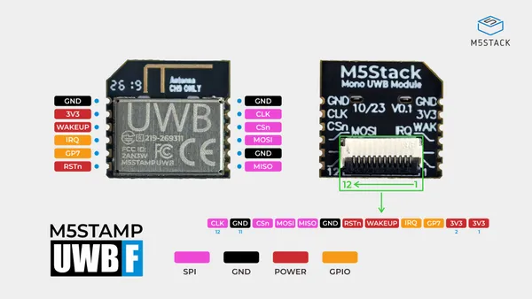
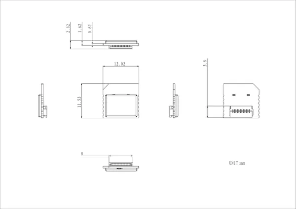

# Stamp UWB F

**M5Stack** · Expansion

Revision: Not identified  
Coverage: Pinout image collected

[Browse all manufacturers](../../../../BROWSE.md) · [Desktop app](https://github.com/valleytechsolutions/black-wire-desktop)

## Pinout

**pinout image** · Reviewed source · JPG

[Open original reference](../../../../library/media/7585b75e4d85c73fd46bae0737b7eb36c25c8428886b3680d6353e78dc83965b.jpg)

**Credit and rights:** Not established; source attribution retained. Source/manufacturer: M5Stack.

[Source 1](https://m5stack-doc.oss-cn-shenzhen.aliyuncs.com/1269/S017-F_Stamp_UWB_F.jpg) · [Source 2](https://docs.m5stack.com/en/stamp/Stamp_UWB_F)

Imported from existing M5Stack Board Reference; original working path preserved.

SHA-256: `7585b75e4d85c73fd46bae0737b7eb36c25c8428886b3680d6353e78dc83965b`

## Dimensions

**source reference** · Unreviewed source · PNG

[Open original reference](../../../../library/media/c556acaecee8d3b289df1d7afedf36c2806b4685ecd50a02fcc33ecaf699b3e2.png)

**Credit and rights:** Source rights not yet established. Source/manufacturer: M5Stack.

[Source 1](https://m5stack-doc.oss-cn-shenzhen.aliyuncs.com/1269/S017-F-Stamp_UWB_F_model_size_page_01.png) · [Source 2](https://docs.m5stack.com/en/stamp/Stamp_UWB_F)

Original source index: Dimensions. This file is searchable but has not been promoted to a reviewed physical board pinout.

SHA-256: `c556acaecee8d3b289df1d7afedf36c2806b4685ecd50a02fcc33ecaf699b3e2`

Pin assignments have not been independently electrically verified. Check board revision before wiring.
