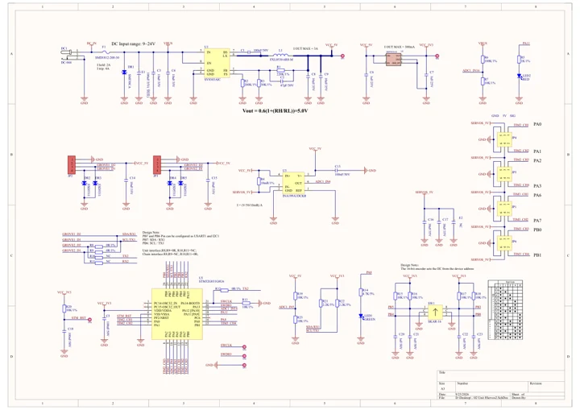

# Unit 8Servos2-I2C

**M5Stack** · Expansion

Revision: Not identified

Coverage: Manufacturer references reviewed by scope; independent electrical and all-connector review pending

[Browse all manufacturers](../../../../BROWSE.md) · [Devices & IoT](../../../../DEVICES.md) · [Open in the browser guide](https://valleytech-black-wire-guide.pages.dev/?board=m5stack-expansion-unit-8servos2-i2c)

## Datasheets and original documentation

Board datasheet: **not yet recorded**. Visual reference: **available**.

[Manufacturer hardware documentation](https://docs.m5stack.com/en/unit/Unit_8Servos2-I2C)

- **schematic / board**: [Unit 8Servos2-I2C Schematic PDF](https://m5stack-doc.oss-cn-shenzhen.aliyuncs.com/1281/SCH_Unit_8Servos2-I2C_V0.4_SCH_PDF_20260526_2026_05_26_11_47_47.pdf) · [saved document](../../../../library/media/0bfcb87adeba6984e559a2376f8738234ade66b67d156a67bacdedcc751a71eb.pdf)
- **hardware-guide / board**: [Manufacturer pin and hardware documentation](https://docs.m5stack.com/en/unit/Unit_8Servos2-I2C) · online

A chip datasheet, schematic and board datasheet have different scopes. Match the exact hardware revision.

[Documentation coverage and remaining gaps](../../../../DOCUMENTATION.md)

## Pinout

**board labeling image** · Reviewed source · PNG

[Open original reference](../../../../library/media/f7dba6934728bb290f982c32f9fc61550434f63955358763469650e115266ab8.png)

**Credit and rights:** Not established; source attribution retained. Source/manufacturer: M5Stack.

[Source 1](https://m5stack-doc.oss-cn-shenzhen.aliyuncs.com/1281/U222_Unit_8Servos2-I2C_Rotary_Encoder.png) · [Source 2](https://docs.m5stack.com/en/unit/Unit_8Servos2-I2C)

Imported from existing M5Stack Board Reference; original working path preserved.

Image revision: Not identified

SHA-256: `f7dba6934728bb290f982c32f9fc61550434f63955358763469650e115266ab8`

## Unit 8Servos2-I2C Schematic PDF

**original reference PDF** · Manufacturer source and first-page preview inspected; electrical correctness and all-connector completeness not independently approved. · PDF

[Open original reference](../../../../library/media/0bfcb87adeba6984e559a2376f8738234ade66b67d156a67bacdedcc751a71eb.pdf)

**Credit and rights:** Manufacturer artwork; reuse and print rights not established. Inclusion does not relicense the original.. Source/manufacturer: M5Stack.

[Source 1](https://m5stack-doc.oss-cn-shenzhen.aliyuncs.com/1281/SCH_Unit_8Servos2-I2C_V0.4_SCH_PDF_20260526_2026_05_26_11_47_47.pdf) · [Source 2](https://docs.m5stack.com/en/unit/Unit_8Servos2-I2C)

Manufacturer source retained unchanged. Manufacturer source and first-page preview inspected; electrical correctness and all-connector completeness not independently approved.

Image revision: As supplied in the original; match exact board revision

SHA-256: `0bfcb87adeba6984e559a2376f8738234ade66b67d156a67bacdedcc751a71eb`

Pin assignments have not been independently electrically verified. Check board revision before wiring.
