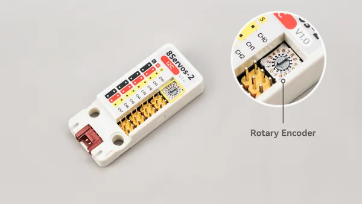

# Unit 8Servos2-I2C

**M5Stack** · Expansion

Revision: Not identified

Coverage: Board labels only; pinout needed

[Browse all manufacturers](../../../../BROWSE.md) · [Devices & IoT](../../../../DEVICES.md) · [Open in the browser guide](https://valleytech-black-wire-guide.pages.dev/?board=m5stack-expansion-unit-8servos2-i2c)

## Datasheets and original documentation

Board datasheet: **not yet recorded**. Visual reference: **available**.

[Manufacturer source (recorded link)](https://docs.m5stack.com/en/unit/Unit_8Servos2-I2C)

A chip datasheet, schematic and board datasheet have different scopes. Match the exact hardware revision.

[Documentation coverage and remaining gaps](../../../../DOCUMENTATION.md)

## Pinout

**board labeling image** · Reviewed source · PNG

[Open original reference](../../../../library/media/f7dba6934728bb290f982c32f9fc61550434f63955358763469650e115266ab8.png)

**Credit and rights:** Not established; source attribution retained. Source/manufacturer: M5Stack.

[Source 1](https://m5stack-doc.oss-cn-shenzhen.aliyuncs.com/1281/U222_Unit_8Servos2-I2C_Rotary_Encoder.png) · [Source 2](https://docs.m5stack.com/en/unit/Unit_8Servos2-I2C)

Imported from existing M5Stack Board Reference; original working path preserved.

Image revision: Not identified

SHA-256: `f7dba6934728bb290f982c32f9fc61550434f63955358763469650e115266ab8`

Pin assignments have not been independently electrically verified. Check board revision before wiring.
