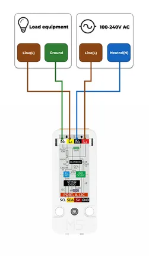
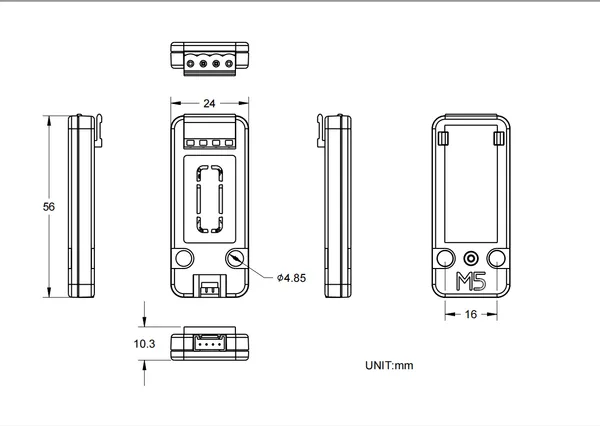

# Unit AC Measure

**M5Stack** · Expansion

Revision: Not identified  
Coverage: GPIO reference collected; physical pinout needed

[Browse all manufacturers](../../../../BROWSE.md) · [Desktop app](https://github.com/valleytechsolutions/black-wire-desktop)

## Pinout

**GPIO reference image** · Reviewed source · PNG

[Open original reference](../../../../library/media/3612904cfd942fd660e38df0d1ddac1c045734130c21155d243ba075e2fc2c39.png)

**Credit and rights:** Not established; source attribution retained. Source/manufacturer: M5Stack.

[Source 1](https://m5stack-doc.oss-cn-shenzhen.aliyuncs.com/744/connector.png) · [Source 2](https://docs.m5stack.com/en/unit/AC%20Measure%20Unit)

Imported from existing M5Stack Board Reference; original working path preserved.

SHA-256: `3612904cfd942fd660e38df0d1ddac1c045734130c21155d243ba075e2fc2c39`

## Dimensions

**source reference** · Unreviewed source · PNG

[Open original reference](../../../../library/media/4039cd5836e834f0233f919c1ff0c3b009a9df1daad0bf313049bd43e037aa54.png)

**Credit and rights:** Source rights not yet established. Source/manufacturer: M5Stack.

[Source 1](https://static-cdn.m5stack.com/resource/docs/products/unit/AC Measure Unit/img-9b8c7dfb-082c-4136-8aa8-dd395c2f12fd.png) · [Source 2](https://docs.m5stack.com/en/unit/AC%20Measure%20Unit)

Original source index: Dimensions. This file is searchable but has not been promoted to a reviewed physical board pinout.

SHA-256: `4039cd5836e834f0233f919c1ff0c3b009a9df1daad0bf313049bd43e037aa54`

Pin assignments have not been independently electrically verified. Check board revision before wiring.
