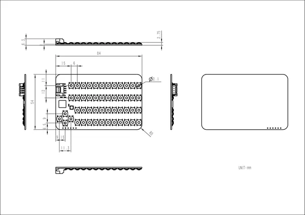

# Unit CardKB v1.1

**M5Stack** · Expansion

Revision: Not identified  
Coverage: GPIO reference collected; physical pinout needed

[Browse all manufacturers](../../../../BROWSE.md) · [Desktop app](https://github.com/valleytechsolutions/black-wire-desktop)

## Pinout (ISP Header)

**GPIO reference image** · Reviewed source · PNG

[Open original reference](../../../../library/media/b4d54e2c19d4d31bd8dd28671a8b5ca6540502456486ad74358e884c4906a8c4.png)

**Credit and rights:** Not established; source attribution retained. Source/manufacturer: M5Stack.

[Source 1](https://static-cdn.m5stack.com/resource/docs/products/hat/hat-cardkb/mega328_isp_sch_01.webp) · [Source 2](https://docs.m5stack.com/en/unit/cardkb_1.1)

Imported from existing M5Stack Board Reference; original working path preserved.

SHA-256: `b4d54e2c19d4d31bd8dd28671a8b5ca6540502456486ad74358e884c4906a8c4`

## Dimensions

**source reference** · Unreviewed source · PNG

[Open original reference](../../../../library/media/76ed13c3d923979d359c94b7d89d10cab4bee078834088ca8683b88fe454ef57.png)

**Credit and rights:** Source rights not yet established. Source/manufacturer: M5Stack.

[Source 1](https://m5stack-doc.oss-cn-shenzhen.aliyuncs.com/806/cardkeyboard_v1_1_page_01.png) · [Source 2](https://docs.m5stack.com/en/unit/cardkb_1.1)

Original source index: Dimensions. This file is searchable but has not been promoted to a reviewed physical board pinout.

SHA-256: `76ed13c3d923979d359c94b7d89d10cab4bee078834088ca8683b88fe454ef57`

Pin assignments have not been independently electrically verified. Check board revision before wiring.
