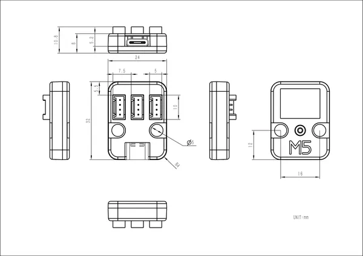

# Unit TypeC to Grove

**M5Stack** · Expansion

Revision: Not identified  
Coverage: Pinout image collected

[Browse all manufacturers](../../../../BROWSE.md) · [Desktop app](https://github.com/valleytechsolutions/black-wire-desktop)

## Pinout

**pinout image** · Reviewed source · PNG

[Open original reference](../../../../library/media/aa47603c2d10f1e2dccfc7d94546e683374718b93b11445e3ffaa62f5bce9641.png)

**Credit and rights:** Not established; source attribution retained. Source/manufacturer: M5Stack.

[Source 1](https://m5stack.oss-cn-shenzhen.aliyuncs.com/resource/docs/products/unit/typec2grove/typec2grove_10.webp) · [Source 2](https://docs.m5stack.com/en/unit/typec2grove)

Imported from existing M5Stack Board Reference; original working path preserved.

SHA-256: `aa47603c2d10f1e2dccfc7d94546e683374718b93b11445e3ffaa62f5bce9641`

## Dimensions

**source reference** · Unreviewed source · PNG

[Open original reference](../../../../library/media/881d6202ca120ff399cabe2b571d425d99613fca3bb3e93c2f2d8234bbb6f182.png)

**Credit and rights:** Source rights not yet established. Source/manufacturer: M5Stack.

[Source 1](https://m5stack-doc.oss-cn-shenzhen.aliyuncs.com/798/U151_Model_Size_sch_01.png) · [Source 2](https://docs.m5stack.com/en/unit/typec2grove)

Original source index: Dimensions. This file is searchable but has not been promoted to a reviewed physical board pinout.

SHA-256: `881d6202ca120ff399cabe2b571d425d99613fca3bb3e93c2f2d8234bbb6f182`

Pin assignments have not been independently electrically verified. Check board revision before wiring.
