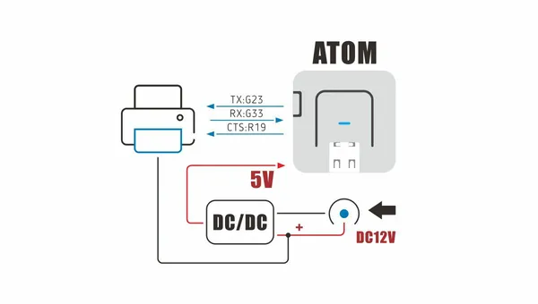

# Atom Printer

**M5Stack** · GPIO device

Revision: Not identified  
Coverage: GPIO reference collected; physical pinout needed

[Browse all manufacturers](../../../../BROWSE.md) · [Desktop app](https://github.com/valleytechsolutions/black-wire-desktop)

## Pinout

**GPIO reference image** · Reviewed source · PNG

[Open original reference](../../../../library/media/0ab10efe1349205d9b2870399a851032161d5ff360b61b64d3c13b4f7f172973.png)

**Credit and rights:** Not established; source attribution retained. Source/manufacturer: M5Stack.

[Source 1](https://static-cdn.m5stack.com/resource/docs/products/atom/atom_printer/atom_printer_sch_01.webp) · [Source 2](https://docs.m5stack.com/en/atom/atom_printer)

Imported from existing M5Stack Board Reference; original working path preserved.

SHA-256: `0ab10efe1349205d9b2870399a851032161d5ff360b61b64d3c13b4f7f172973`

Pin assignments have not been independently electrically verified. Check board revision before wiring.
