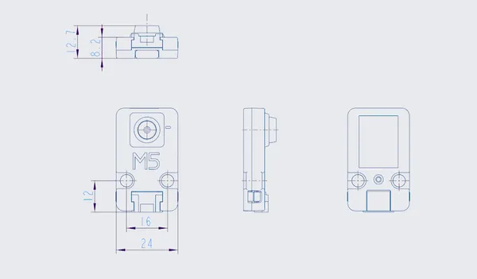

# UnitV-OV2640

**M5Stack** · GPIO device

Revision: Not identified  
Coverage: Pinout image collected

[Browse all manufacturers](../../../../BROWSE.md) · [Devices & IoT](../../../../DEVICES.md) · [Open in the browser guide](https://valleytech-black-wire-guide.pages.dev/?board=m5stack-gpio-device-unitv-ov2640)

Device category: **Cameras & audio**

## Pinout

**pinout image** · Reviewed source · PNG

[Open original reference](../../../../library/media/629396d7e80dd92cb60a0fc95699c71e9eca345efd1367d49c594d1e955c2852.png)

**Credit and rights:** Not established; source attribution retained. Source/manufacturer: M5Stack.

[Source 1](https://static-cdn.m5stack.com/resource/docs/products/unit/unitv/unitv_05.webp) · [Source 2](https://docs.m5stack.com/en/unit/unitv)

Imported from existing M5Stack Board Reference; original working path preserved.

Image revision: Not identified

SHA-256: `629396d7e80dd92cb60a0fc95699c71e9eca345efd1367d49c594d1e955c2852`

## Dimensions

**source reference** · Unreviewed source · PNG

[Open original reference](../../../../library/media/5294f1ee3fd074b41fea57b5ef2d9397657166b1c1dca0387707e11eb28bbfd4.png)

**Credit and rights:** Source rights not yet established. Source/manufacturer: M5Stack.

[Source 1](https://static-cdn.m5stack.com/resource/docs/products/unit/unitv/unitv_07.webp) · [Source 2](https://docs.m5stack.com/en/unit/unitv)

Original source index: Dimensions. This file is searchable but has not been promoted to a reviewed physical board pinout.

Image revision: Not identified

SHA-256: `5294f1ee3fd074b41fea57b5ef2d9397657166b1c1dca0387707e11eb28bbfd4`

Pin assignments have not been independently electrically verified. Check board revision before wiring.
