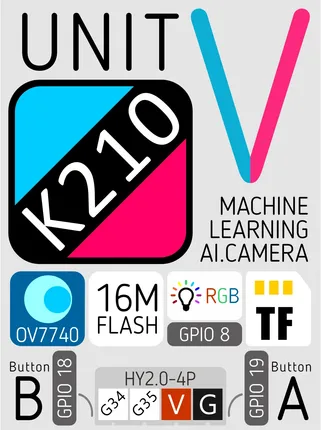
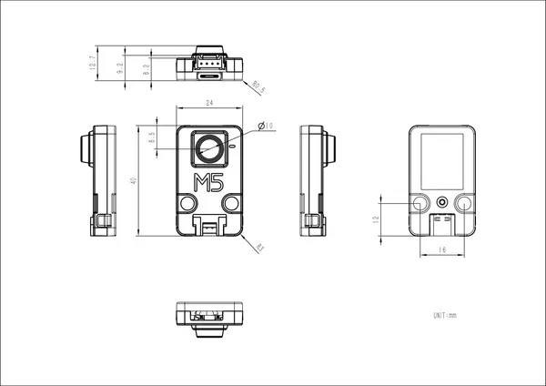

# UnitV-OV7740

**M5Stack** · GPIO device

Revision: Not identified  
Coverage: Pinout image collected

[Browse all manufacturers](../../../../BROWSE.md) · [Desktop app](https://github.com/valleytechsolutions/black-wire-desktop)

## Pinout

**pinout image** · Reviewed source · PNG

[Open original reference](../../../../library/media/8ef02336edee8d9faad229efc29b0ad888146865e715ee4c392708d9fc3d8e5b.png)

**Credit and rights:** Not established; source attribution retained. Source/manufacturer: M5Stack.

[Source 1](https://static-cdn.m5stack.com/resource/docs/products/unit/unitv_ov7740/unitv_ov7740_12.webp) · [Source 2](https://docs.m5stack.com/en/unit/unitv_ov7740)

Imported from existing M5Stack Board Reference; original working path preserved.

SHA-256: `8ef02336edee8d9faad229efc29b0ad888146865e715ee4c392708d9fc3d8e5b`

## Dimensions

**source reference** · Unreviewed source · PNG

[Open original reference](../../../../library/media/36ba51ffca625278db3ec53a73aeb5af9a410594a9cb4e65b1e3dc4d1b6aee79.png)

**Credit and rights:** Source rights not yet established. Source/manufacturer: M5Stack.

[Source 1](https://m5stack-doc.oss-cn-shenzhen.aliyuncs.com/1055/U078-C_Model_Size_page_01.png) · [Source 2](https://docs.m5stack.com/en/unit/unitv_ov7740)

Original source index: Dimensions. This file is searchable but has not been promoted to a reviewed physical board pinout.

SHA-256: `36ba51ffca625278db3ec53a73aeb5af9a410594a9cb4e65b1e3dc4d1b6aee79`

Pin assignments have not been independently electrically verified. Check board revision before wiring.
