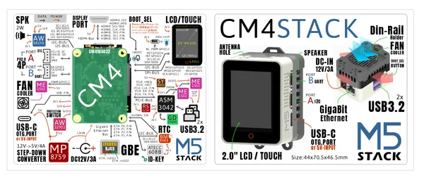
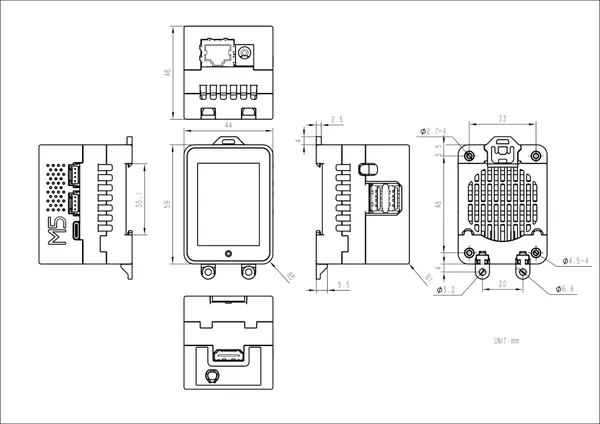

# CM4Stack

**M5Stack** · Other SBC

Revision: Not identified  
Coverage: GPIO reference collected; physical pinout needed

[Browse all manufacturers](../../../../BROWSE.md) · [Desktop app](https://github.com/valleytechsolutions/black-wire-desktop)

## Pinout

**GPIO reference image** · Reviewed source · PNG

[Open original reference](../../../../library/media/9766b1c532fa83d3f8a7bfb393a2cc0e70437f40d666916302d93685442b30bf.png)

**Credit and rights:** Not established; source attribution retained. Source/manufacturer: M5Stack.

[Source 1](https://m5stack-doc.oss-cn-shenzhen.aliyuncs.com/484/K127_PinMap_01.png) · [Source 2](https://docs.m5stack.com/en/core/CM4Stack)

Imported from existing M5Stack Board Reference; original working path preserved.

SHA-256: `9766b1c532fa83d3f8a7bfb393a2cc0e70437f40d666916302d93685442b30bf`

## Dimensions

**source reference** · Unreviewed source · JPG

[Open original reference](../../../../library/media/8bb462b53cc152f7b6048f4d7030980963e365f7517804d6bc325b4a3dea68da.jpg)

**Credit and rights:** Source rights not yet established. Source/manufacturer: M5Stack.

[Source 1](https://m5stack.oss-cn-shenzhen.aliyuncs.com/resource/docs/products/core/CM4Stack/%E5%B0%BA%E5%AF%B8%E5%9B%BE.jpg) · [Source 2](https://docs.m5stack.com/en/core/CM4Stack)

Original source index: Dimensions. This file is searchable but has not been promoted to a reviewed physical board pinout.

SHA-256: `8bb462b53cc152f7b6048f4d7030980963e365f7517804d6bc325b4a3dea68da`

Pin assignments have not been independently electrically verified. Check board revision before wiring.
