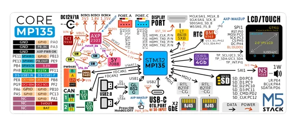
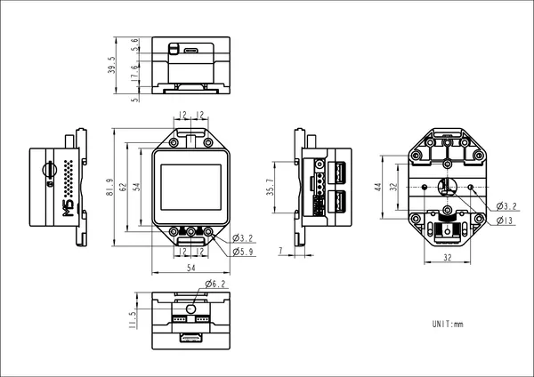

# CoreMP135

**M5Stack** · Other SBC

Revision: Not identified  
Coverage: GPIO reference collected; physical pinout needed

[Browse all manufacturers](../../../../BROWSE.md) · [Desktop app](https://github.com/valleytechsolutions/black-wire-desktop)

## Pinout

**GPIO reference image** · Reviewed source · PNG

[Open original reference](../../../../library/media/5815628dca61b43ccdc2fee72bfca4ddc0584b12afe92b38e5ec2bd7d9fcad52.png)

**Credit and rights:** Not established; source attribution retained. Source/manufacturer: M5Stack.

[Source 1](https://m5stack-doc.oss-cn-shenzhen.aliyuncs.com/497/K135_pinmap_01.png) · [Source 2](https://docs.m5stack.com/en/core/M5CoreMP135)

Imported from existing M5Stack Board Reference; original working path preserved.

SHA-256: `5815628dca61b43ccdc2fee72bfca4ddc0584b12afe92b38e5ec2bd7d9fcad52`

## Dimensions

**source reference** · Unreviewed source · PNG

[Open original reference](../../../../library/media/90f396543cae00185a17254df7558b6abdeedf17f1cf41916c108e5ae4212d99.png)

**Credit and rights:** Source rights not yet established. Source/manufacturer: M5Stack.

[Source 1](https://static-cdn.m5stack.com/resource/docs/products/core/M5CoreMP135/img-505b3448-ea63-497b-85d9-07a7a4259edb.png) · [Source 2](https://docs.m5stack.com/en/core/M5CoreMP135)

Original source index: Dimensions. This file is searchable but has not been promoted to a reviewed physical board pinout.

SHA-256: `90f396543cae00185a17254df7558b6abdeedf17f1cf41916c108e5ae4212d99`

Pin assignments have not been independently electrically verified. Check board revision before wiring.
