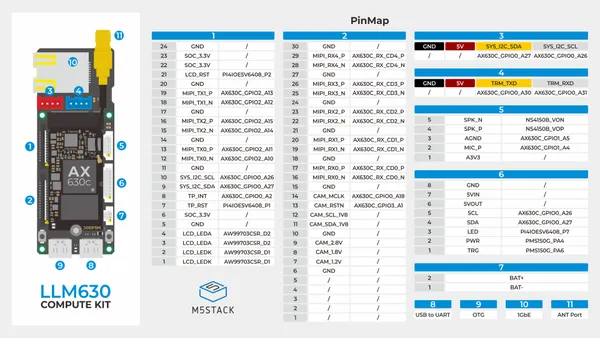
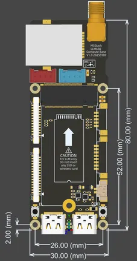

# LLM630 Compute Kit

**M5Stack** · Other SBC

Revision: Not identified  
Coverage: GPIO reference collected; physical pinout needed

[Browse all manufacturers](../../../../BROWSE.md) · [Desktop app](https://github.com/valleytechsolutions/black-wire-desktop)

## Pinout

**GPIO reference image** · Reviewed source · JPG

[Open original reference](../../../../library/media/25c21fc75f8e57d8fe641fa552d9a346766db263a1ed04eee308d847d0f6677a.jpg)

**Credit and rights:** Not established; source attribution retained. Source/manufacturer: M5Stack.

[Source 1](https://m5stack.oss-cn-shenzhen.aliyuncs.com/resource/docs/products/core/LLM630%20Computer%20Kit/LLM630%20PinMap.jpg) · [Source 2](https://docs.m5stack.com/en/core/LLM630%20Compute%20Kit)

Imported from existing M5Stack Board Reference; original working path preserved.

SHA-256: `25c21fc75f8e57d8fe641fa552d9a346766db263a1ed04eee308d847d0f6677a`

## Dimensions

**source reference** · Unreviewed source · PNG

[Open original reference](../../../../library/media/84e8db4c9296ccf2d8d4d01faab10cb3042b84828a9ea287b8b60baf920b4a9a.png)

**Credit and rights:** Source rights not yet established. Source/manufacturer: M5Stack.

[Source 1](https://m5stack.oss-cn-shenzhen.aliyuncs.com/resource/docs/products/core/LLM630%20Computer%20Kit/model%20size.png) · [Source 2](https://docs.m5stack.com/en/core/LLM630%20Compute%20Kit)

Original source index: Dimensions. This file is searchable but has not been promoted to a reviewed physical board pinout.

SHA-256: `84e8db4c9296ccf2d8d4d01faab10cb3042b84828a9ea287b8b60baf920b4a9a`

Pin assignments have not been independently electrically verified. Check board revision before wiring.
