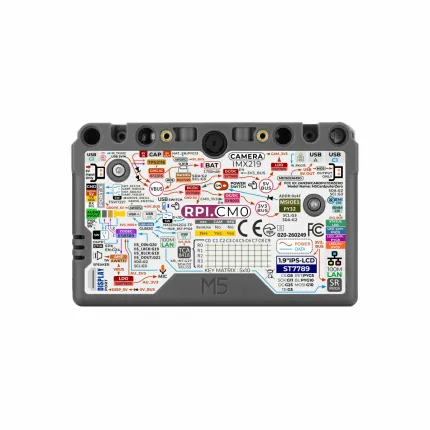
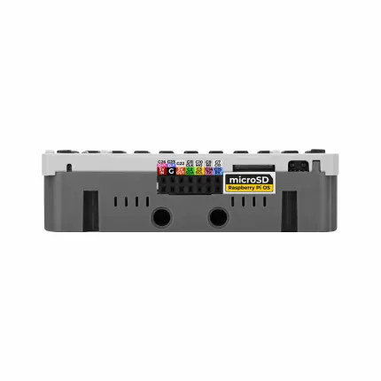
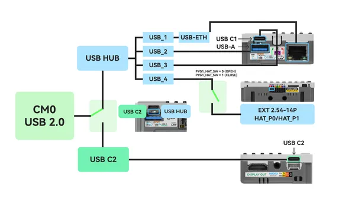

# CardputerZero

**M5Stack** · Raspberry Pi CM0

Revision: Not identified  
Coverage: Pinout image collected

[Browse all manufacturers](../../../../BROWSE.md) · [Devices & IoT](../../../../DEVICES.md) · [Open in the browser guide](https://valleytech-black-wire-guide.pages.dev/?board=m5stack-gpio-device-cardputerzero)

Device category: **Handhelds & pocket tools**

M5Stack marks packaging and software as work in progress; features and documentation may change.

## Rear GPIO and peripheral reference label

**pinout image** · Reviewed source · WEBP

[Open original reference](../../../../library/media/985cab63c2d6dde209a952656f3577858e60e8a1263fc4cb0910f94e9751bce6.webp)

**Credit and rights:** Not established; source attribution retained. Source/manufacturer: M5Stack.

[Source 1](https://m5stack-doc.oss-cn-shenzhen.aliyuncs.com/1243/C154-CardputerZero-main-pictures_08.png) · [Source 2](https://docs.m5stack.com/en/CardputerZero)

Official source marks this product and documentation as work in progress; not assumed interchangeable with Cardputer-Adv.

Image revision: Not identified

SHA-256: `985cab63c2d6dde209a952656f3577858e60e8a1263fc4cb0910f94e9751bce6`

## EXT14P physical connector pin labels

**pinout image** · Reviewed source · WEBP

[Open original reference](../../../../library/media/6aee9f746bd4b25c57dcb64e4337865e848b7dfc138bc2831a2e644c9f9c2259.webp)

**Credit and rights:** Not established; source attribution retained. Source/manufacturer: M5Stack.

[Source 1](https://m5stack-doc.oss-cn-shenzhen.aliyuncs.com/1243/C154-CardputerZero-main-pictures_11.png) · [Source 2](https://docs.m5stack.com/en/CardputerZero)

Official source marks this product and documentation as work in progress; not assumed interchangeable with Cardputer-Adv.

Image revision: Not identified

SHA-256: `6aee9f746bd4b25c57dcb64e4337865e848b7dfc138bc2831a2e644c9f9c2259`

## Pinout

**board labeling image** · Reviewed source · PNG

[Open original reference](../../../../library/media/b9be09c6fc5c54e8c82547426fb56dd0233f6f23168b085c547a06f29589e43e.png)

**Credit and rights:** Not established; source attribution retained. Source/manufacturer: M5Stack.

[Source 1](https://m5stack-doc.oss-cn-shenzhen.aliyuncs.com/1243/cardputerzero_usb_sch_01.png) · [Source 2](https://docs.m5stack.com/en/CardputerZero)

Imported from existing M5Stack Board Reference; original working path preserved.

Image revision: Not identified

SHA-256: `b9be09c6fc5c54e8c82547426fb56dd0233f6f23168b085c547a06f29589e43e`

Pin assignments have not been independently electrically verified. Check board revision before wiring.
