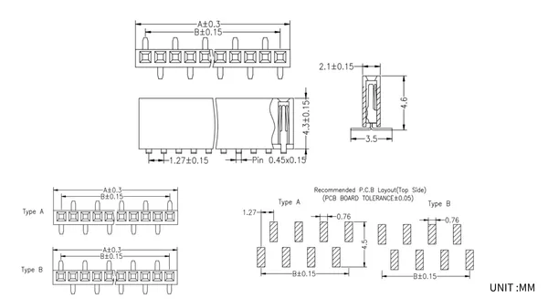

# 1.27-Socket Kit for Stamp-S3

**M5Stack** · Source collection

Revision: Unverified source identity  
Coverage: Source collection; review pending

[Browse all manufacturers](../../../../BROWSE.md) · [Desktop app](https://github.com/valleytechsolutions/black-wire-desktop)

## Dimensions

**source reference** · Unreviewed source · PNG

[Open original reference](../../../../library/media/bda2e8a1674715483a68d5075e55a4ba0b60c8aeba31ebef1d844c6129994708.png)

**Credit and rights:** Source rights not yet established. Source/manufacturer: M5Stack.

[Source 1](https://static-cdn.m5stack.com/resource/docs/products/accessory/1.27-Socket Kit for StampS3/img-6aac7145-df75-4067-9135-f02df4390e06.png) · [Source 2](https://docs.m5stack.com/en/accessory/1.27-Socket%20Kit%20for%20StampS3)

Original source index: Dimensions. This file is searchable but has not been promoted to a reviewed physical board pinout.

SHA-256: `bda2e8a1674715483a68d5075e55a4ba0b60c8aeba31ebef1d844c6129994708`

Pin assignments have not been independently electrically verified. Check board revision before wiring.
