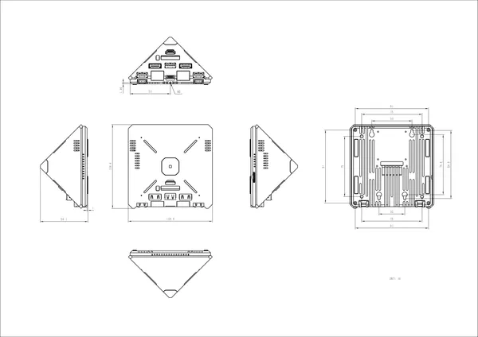
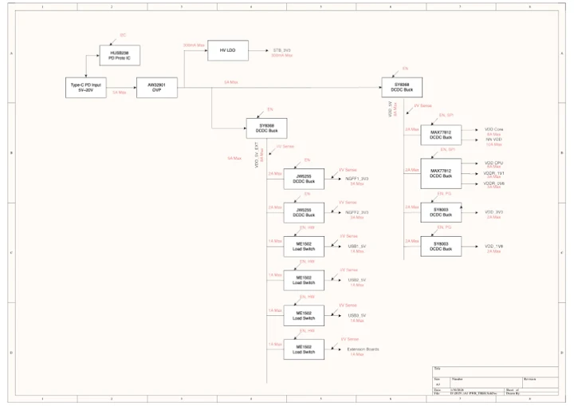
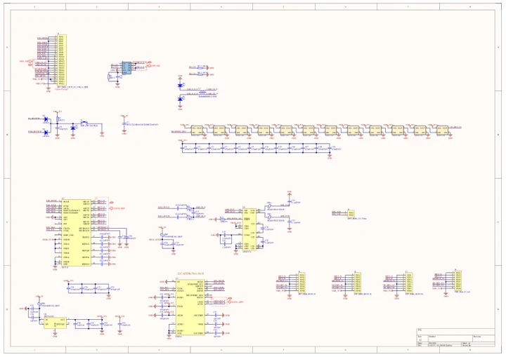
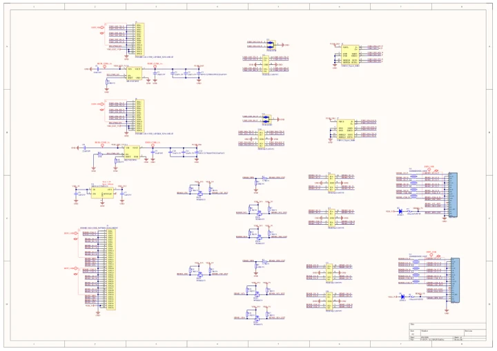

# AI Pyramid

**M5Stack** · Source collection

Revision: Unverified source identity

Coverage: Manufacturer references reviewed by scope; independent electrical and all-connector review pending

[Browse all manufacturers](../../../../BROWSE.md) · [Devices & IoT](../../../../DEVICES.md) · [Open in the browser guide](https://valleytech-black-wire-guide.pages.dev/?board=source-board-b5d19cbbec5a5c8ee7)

## Datasheets and original documentation

Board datasheet: **not yet recorded**. Visual reference: **available**.

[Manufacturer hardware documentation](https://docs.m5stack.com/en/ai_hardware/AI_Pyramid)

- **schematic / board**: [AI Pyramid Schematics PDF](https://m5stack-doc.oss-cn-shenzhen.aliyuncs.com/1213/AI-003-AI_Pyramid_PRJ_MAIN_V0.2_20251117_2026_01_30_16_54_30.pdf) · [saved document](../../../../library/media/02e6b4eb94e91ebee6a7e23c2d5d3237d9e84aa5f4a7804153be30b22e59597a.pdf)
- **schematic / board**: [AI Pyramid PCB Key Schematics PDF](https://m5stack-doc.oss-cn-shenzhen.aliyuncs.com/1213/AI-003-AI_Pyramid_PCB_KEY_V0.2_2026_01_30_16_52_44.pdf) · [saved document](../../../../library/media/e6dadc5501d4f7149fe3f3c06caddfa8c4f1aa594167ab21992c70b3855ac3b3.pdf)
- **schematic / board**: [AI Pyramid HDMI Schematics PDF](https://m5stack-doc.oss-cn-shenzhen.aliyuncs.com/1213/AI-003-AI_Pyramid_PRJ_HDMI_V0.3_20251031_2026_01_30_16_51_54.pdf) · [saved document](../../../../library/media/0204c4fd546bd9d9b81ebb713fed3da8743919c36639e3fdb52676db361ed0b7.pdf)
- **hardware-guide / board**: [Manufacturer pin and hardware documentation](https://docs.m5stack.com/en/ai_hardware/AI_Pyramid) · online

A chip datasheet, schematic and board datasheet have different scopes. Match the exact hardware revision.

[Documentation coverage and remaining gaps](../../../../DOCUMENTATION.md)

## Dimensions

**source reference** · Unreviewed source · PNG

[Open original reference](../../../../library/media/d9baac7159476ed6df50a4260d8c4d514da51728d5faf21e71bdd5b9b260c041.png)

**Credit and rights:** Source rights not yet established. Source/manufacturer: M5Stack.

[Source 1](https://m5stack-doc.oss-cn-shenzhen.aliyuncs.com/1216/ai-pyraim_asm_page_01.png) · [Source 2](https://docs.m5stack.com/en/ai_hardware/AI_Pyramid)

Original source index: Dimensions. This file is searchable but has not been promoted to a reviewed physical board pinout.

Image revision: Not identified

SHA-256: `d9baac7159476ed6df50a4260d8c4d514da51728d5faf21e71bdd5b9b260c041`

## AI Pyramid Schematics PDF

**original reference PDF** · Source identity and visual scope inspected; PDF review covers first-page preview. Independent electrical and all-connector completeness review pending. · PDF

[Open original reference](../../../../library/media/02e6b4eb94e91ebee6a7e23c2d5d3237d9e84aa5f4a7804153be30b22e59597a.pdf)

**Credit and rights:** Manufacturer artwork; reuse and print rights not established. Inclusion does not relicense the original.. Source/manufacturer: M5Stack.

[Source 1](https://m5stack-doc.oss-cn-shenzhen.aliyuncs.com/1213/AI-003-AI_Pyramid_PRJ_MAIN_V0.2_20251117_2026_01_30_16_54_30.pdf) · [Source 2](https://docs.m5stack.com/en/ai_hardware/AI_Pyramid)

Manufacturer source retained unchanged. Source identity and visual scope inspected; PDF review covers first-page preview. Independent electrical and all-connector completeness review pending.

Image revision: As supplied in the original; match exact board revision

SHA-256: `02e6b4eb94e91ebee6a7e23c2d5d3237d9e84aa5f4a7804153be30b22e59597a`

## AI Pyramid PCB Key Schematics PDF

**original reference PDF** · Source identity and visual scope inspected; PDF review covers first-page preview. Independent electrical and all-connector completeness review pending. · PDF

[Open original reference](../../../../library/media/e6dadc5501d4f7149fe3f3c06caddfa8c4f1aa594167ab21992c70b3855ac3b3.pdf)

**Credit and rights:** Manufacturer artwork; reuse and print rights not established. Inclusion does not relicense the original.. Source/manufacturer: M5Stack.

[Source 1](https://m5stack-doc.oss-cn-shenzhen.aliyuncs.com/1213/AI-003-AI_Pyramid_PCB_KEY_V0.2_2026_01_30_16_52_44.pdf) · [Source 2](https://docs.m5stack.com/en/ai_hardware/AI_Pyramid)

Manufacturer source retained unchanged. Source identity and visual scope inspected; PDF review covers first-page preview. Independent electrical and all-connector completeness review pending.

Image revision: As supplied in the original; match exact board revision

SHA-256: `e6dadc5501d4f7149fe3f3c06caddfa8c4f1aa594167ab21992c70b3855ac3b3`

## AI Pyramid HDMI Schematics PDF

**original reference PDF** · Manufacturer source and first-page preview inspected; independent electrical and all-connector completeness review pending. · PDF

[Open original reference](../../../../library/media/0204c4fd546bd9d9b81ebb713fed3da8743919c36639e3fdb52676db361ed0b7.pdf)

**Credit and rights:** Manufacturer artwork; reuse and print rights not established. Inclusion does not relicense the original.. Source/manufacturer: M5Stack.

[Source 1](https://m5stack-doc.oss-cn-shenzhen.aliyuncs.com/1213/AI-003-AI_Pyramid_PRJ_HDMI_V0.3_20251031_2026_01_30_16_51_54.pdf) · [Source 2](https://docs.m5stack.com/en/ai_hardware/AI_Pyramid)

Manufacturer source retained unchanged. Manufacturer source and first-page preview inspected; independent electrical and all-connector completeness review pending.

Image revision: As supplied in the original; match exact board revision

SHA-256: `0204c4fd546bd9d9b81ebb713fed3da8743919c36639e3fdb52676db361ed0b7`

Pin assignments have not been independently electrically verified. Check board revision before wiring.
