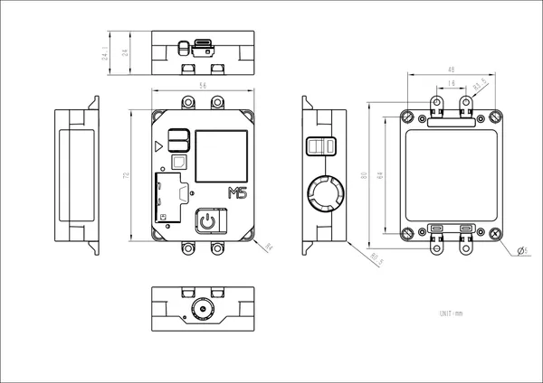

# Air Quality

**M5Stack** · Source collection

Revision: Unverified source identity  
Coverage: Source collection; review pending

[Browse all manufacturers](../../../../BROWSE.md) · [Desktop app](https://github.com/valleytechsolutions/black-wire-desktop)

## Dimensions

**source reference** · Unreviewed source · JPG

[Open original reference](../../../../library/media/8ca76cc890f02f1790a87c2feddb3f7cffb9f9d468e2684f55e6383418461c0e.jpg)

**Credit and rights:** Source rights not yet established. Source/manufacturer: M5Stack.

[Source 1](https://static-cdn.m5stack.com/resource/docs/products/core/AirQ/img-cb5c5066-ca41-40f2-943c-64ddc02de03b.jpg) · [Source 2](https://docs.m5stack.com/en/core/Air_Quality)

Original source index: Dimensions. This file is searchable but has not been promoted to a reviewed physical board pinout.

SHA-256: `8ca76cc890f02f1790a87c2feddb3f7cffb9f9d468e2684f55e6383418461c0e`

Pin assignments have not been independently electrically verified. Check board revision before wiring.
