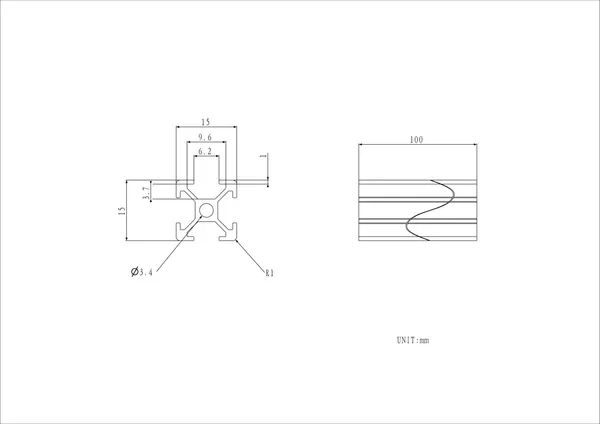
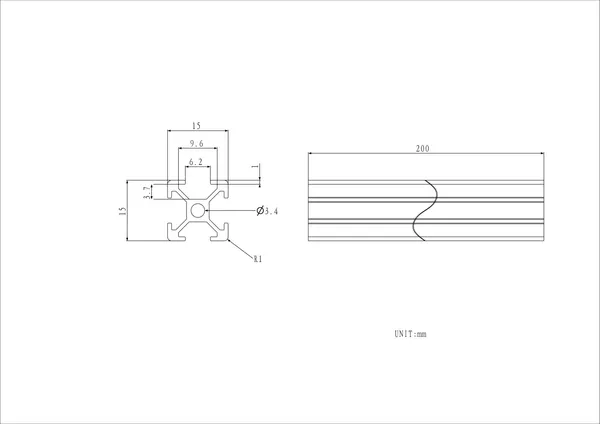
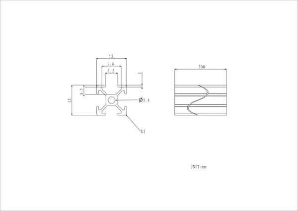
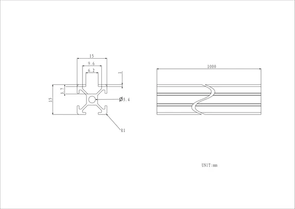
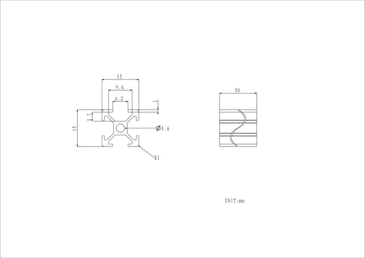

# Aluminium Extrusions

**M5Stack** · Source collection

Revision: Unverified source identity  
Coverage: Source collection; review pending

[Browse all manufacturers](../../../../BROWSE.md) · [Desktop app](https://github.com/valleytechsolutions/black-wire-desktop)

## Dimensions

**source reference** · Unreviewed source · PNG

[Open original reference](../../../../library/media/194701d62d0feb0abbe89cae4c13de21eaefbc2476f006998687122b3364b8c7.png)

**Credit and rights:** Source rights not yet established. Source/manufacturer: M5Stack.

[Source 1](https://m5stack-doc.oss-cn-shenzhen.aliyuncs.com/1167/Aluminium-Extrusionsa062_page_01.png) · [Source 2](https://docs.m5stack.com/en/1515/ap)

Original source index: Dimensions. This file is searchable but has not been promoted to a reviewed physical board pinout.

SHA-256: `194701d62d0feb0abbe89cae4c13de21eaefbc2476f006998687122b3364b8c7`

## Dimensions

**source reference** · Unreviewed source · PNG

[Open original reference](../../../../library/media/7471b9cc585ae2dde89804ad7df2d28b6f2992e1a171392353db0115e883f74c.png)

**Credit and rights:** Source rights not yet established. Source/manufacturer: M5Stack.

[Source 1](https://m5stack-doc.oss-cn-shenzhen.aliyuncs.com/1167/Aluminium-Extrusionsa063_page_01.png) · [Source 2](https://docs.m5stack.com/en/1515/ap)

Original source index: Dimensions. This file is searchable but has not been promoted to a reviewed physical board pinout.

SHA-256: `7471b9cc585ae2dde89804ad7df2d28b6f2992e1a171392353db0115e883f74c`

## Dimensions

**source reference** · Unreviewed source · PNG

[Open original reference](../../../../library/media/d200fa21e48b09edaaa53a80b5ab66a17122dc72320809c0a0c043170a4239ad.png)

**Credit and rights:** Source rights not yet established. Source/manufacturer: M5Stack.

[Source 1](https://m5stack-doc.oss-cn-shenzhen.aliyuncs.com/1167/Aluminium-Extrusionsa064_page_01.png) · [Source 2](https://docs.m5stack.com/en/1515/ap)

Original source index: Dimensions. This file is searchable but has not been promoted to a reviewed physical board pinout.

SHA-256: `d200fa21e48b09edaaa53a80b5ab66a17122dc72320809c0a0c043170a4239ad`

## Dimensions

**source reference** · Unreviewed source · PNG

[Open original reference](../../../../library/media/e0dcceab9dbe8ce086308650a76252d194651a10b1981830c53183a058e7e92d.png)

**Credit and rights:** Source rights not yet established. Source/manufacturer: M5Stack.

[Source 1](https://m5stack-doc.oss-cn-shenzhen.aliyuncs.com/1167/Aluminium-Extrusionsa065_page_01.png) · [Source 2](https://docs.m5stack.com/en/1515/ap)

Original source index: Dimensions. This file is searchable but has not been promoted to a reviewed physical board pinout.

SHA-256: `e0dcceab9dbe8ce086308650a76252d194651a10b1981830c53183a058e7e92d`

## Dimensions

**source reference** · Unreviewed source · PNG

[Open original reference](../../../../library/media/d7ab70107f0f9fac950aa8bd50d514a7224dc19765b3b25851cbbfd49d04c991.png)

**Credit and rights:** Source rights not yet established. Source/manufacturer: M5Stack.

[Source 1](https://m5stack-doc.oss-cn-shenzhen.aliyuncs.com/1167/Aluminium-Extrusionsa061_page_01.png) · [Source 2](https://docs.m5stack.com/en/1515/ap)

Original source index: Dimensions. This file is searchable but has not been promoted to a reviewed physical board pinout.

SHA-256: `d7ab70107f0f9fac950aa8bd50d514a7224dc19765b3b25851cbbfd49d04c991`

Pin assignments have not been independently electrically verified. Check board revision before wiring.
