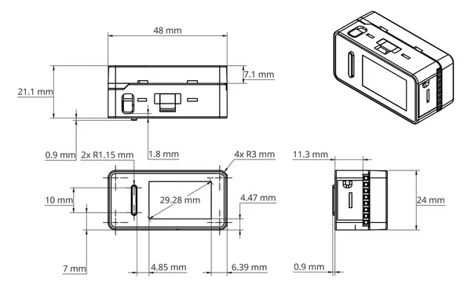
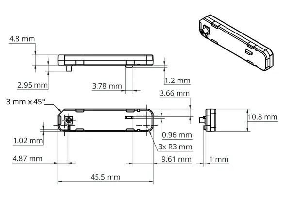
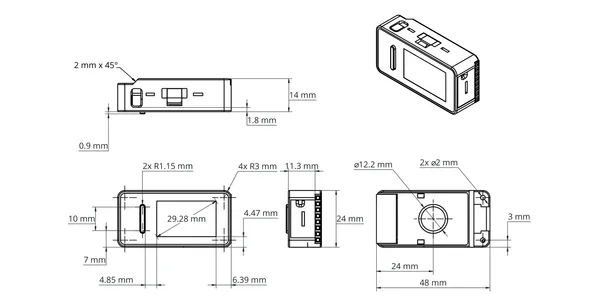

# Arduino Nesso N1

**M5Stack** · Source collection

Revision: Unverified source identity  
Coverage: Source collection; review pending

[Browse all manufacturers](../../../../BROWSE.md) · [Desktop app](https://github.com/valleytechsolutions/black-wire-desktop)

## Dimensions

**source reference** · Unreviewed source · PNG

[Open original reference](../../../../library/media/d41ce73682618f3a18533a6c670b252e8e2fcb5f55ce18ee7424e1314f0f3116.png)

**Credit and rights:** Source rights not yet established. Source/manufacturer: M5Stack.

[Source 1](https://m5stack-doc.oss-cn-shenzhen.aliyuncs.com/1198/DK001-model-size_02.png) · [Source 2](https://docs.m5stack.com/en/core/Arduino_Nesso_N1)

Original source index: Dimensions. This file is searchable but has not been promoted to a reviewed physical board pinout.

SHA-256: `d41ce73682618f3a18533a6c670b252e8e2fcb5f55ce18ee7424e1314f0f3116`

## Dimensions

**source reference** · Unreviewed source · PNG

[Open original reference](../../../../library/media/65fc19bff3f9706df8f8b9499ed31d5a65396460dcef0bc5dd9e894edcbf6e35.png)

**Credit and rights:** Source rights not yet established. Source/manufacturer: M5Stack.

[Source 1](https://m5stack-doc.oss-cn-shenzhen.aliyuncs.com/1198/DK001-model-size_03.png) · [Source 2](https://docs.m5stack.com/en/core/Arduino_Nesso_N1)

Original source index: Dimensions. This file is searchable but has not been promoted to a reviewed physical board pinout.

SHA-256: `65fc19bff3f9706df8f8b9499ed31d5a65396460dcef0bc5dd9e894edcbf6e35`

## Dimensions

**source reference** · Unreviewed source · PNG

[Open original reference](../../../../library/media/9ee2d62804bbf4e0c711dbb8d5ee7874309f8b0edb48b77a4a892c8d4a1c30ae.png)

**Credit and rights:** Source rights not yet established. Source/manufacturer: M5Stack.

[Source 1](https://m5stack-doc.oss-cn-shenzhen.aliyuncs.com/1198/DK001-model-size_01.png) · [Source 2](https://docs.m5stack.com/en/core/Arduino_Nesso_N1)

Original source index: Dimensions. This file is searchable but has not been promoted to a reviewed physical board pinout.

SHA-256: `9ee2d62804bbf4e0c711dbb8d5ee7874309f8b0edb48b77a4a892c8d4a1c30ae`

Pin assignments have not been independently electrically verified. Check board revision before wiring.
