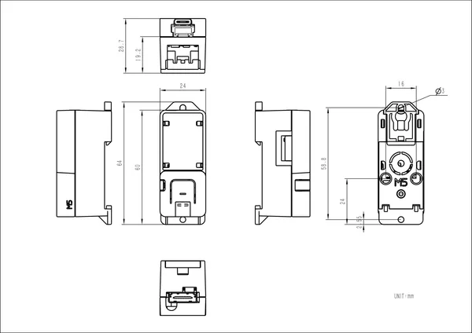

# Atom Display

**M5Stack** · Source collection

Revision: Unverified source identity  
Coverage: Source collection; review pending

[Browse all manufacturers](../../../../BROWSE.md) · [Devices & IoT](../../../../DEVICES.md) · [Open in the browser guide](https://valleytech-black-wire-guide.pages.dev/?board=source-board-a3ee65a1394cc4d38c)

Device category: **Displays & HMI**

## Dimensions

**source reference** · Unreviewed source · PNG

[Open original reference](../../../../library/media/33be75532e5562fd498b0c587fb52a9d3d3b622d6118470fd321d862446e2cd2.png)

**Credit and rights:** Source rights not yet established. Source/manufacturer: M5Stack.

[Source 1](https://m5stack-doc.oss-cn-shenzhen.aliyuncs.com/894/K115-atom-display_page_01.png) · [Source 2](https://docs.m5stack.com/en/atom/atom_display)

Original source index: Dimensions. This file is searchable but has not been promoted to a reviewed physical board pinout.

Image revision: Not identified

SHA-256: `33be75532e5562fd498b0c587fb52a9d3d3b622d6118470fd321d862446e2cd2`

Pin assignments have not been independently electrically verified. Check board revision before wiring.
