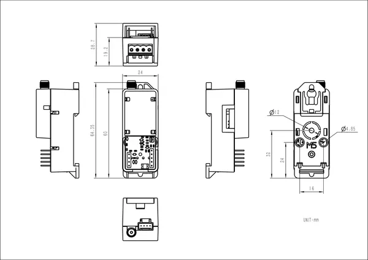
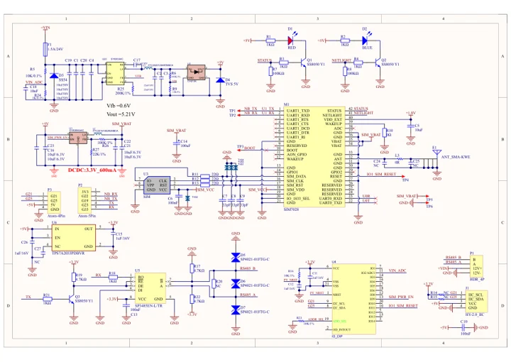

# Atom DTU NBIoT2 v1.1

**M5Stack** · Source collection

Revision: Unverified source identity

Coverage: Manufacturer references reviewed by scope; independent electrical and all-connector review pending

[Browse all manufacturers](../../../../BROWSE.md) · [Devices & IoT](../../../../DEVICES.md) · [Open in the browser guide](https://valleytech-black-wire-guide.pages.dev/?board=source-board-59012570dfcf09c535)

Device category: **Controllers & instruments**

## Datasheets and original documentation

Board datasheet: **not yet recorded**. Visual reference: **available**.

[Manufacturer hardware documentation](https://docs.m5stack.com/en/atom/Atom_DTU_NBIoT2_v1.1)

- **schematic / board**: [Atom DTU NBIoT2 v1.1 Schematics PDF](https://m5stack-doc.oss-cn-shenzhen.aliyuncs.com/1210/SCH_Atom_DTU_NBIoT_v1.1_2025_11_06_19_20_28.pdf) · [saved document](../../../../library/media/2589ebe9eea7418b07c41d7db10b9e7daeddf5e65f63eade977b5d811cf5995b.pdf)
- **hardware-guide / board**: [Manufacturer pin and hardware documentation](https://docs.m5stack.com/en/atom/Atom_DTU_NBIoT2_v1.1) · online

A chip datasheet, schematic and board datasheet have different scopes. Match the exact hardware revision.

[Documentation coverage and remaining gaps](../../../../DOCUMENTATION.md)

## Dimensions

**source reference** · Unreviewed source · PNG

[Open original reference](../../../../library/media/90e41d1b8599574d6a3bb6a58b5bb23ae7a7fc61cbaaeb3f0c62c7fc11603f3e.png)

**Credit and rights:** Source rights not yet established. Source/manufacturer: M5Stack.

[Source 1](https://m5stack-doc.oss-cn-shenzhen.aliyuncs.com/1210/A106-V21-atomdtu_page_01.png) · [Source 2](https://docs.m5stack.com/en/atom/Atom_DTU_NBIoT2_v1.1)

Original source index: Dimensions. This file is searchable but has not been promoted to a reviewed physical board pinout.

Image revision: Not identified

SHA-256: `90e41d1b8599574d6a3bb6a58b5bb23ae7a7fc61cbaaeb3f0c62c7fc11603f3e`

## Atom DTU NBIoT2 v1.1 Schematics PDF

**original reference PDF** · Source identity and visual scope inspected; PDF review covers first-page preview. Independent electrical and all-connector completeness review pending. · PDF

[Open original reference](../../../../library/media/2589ebe9eea7418b07c41d7db10b9e7daeddf5e65f63eade977b5d811cf5995b.pdf)

**Credit and rights:** Manufacturer artwork; reuse and print rights not established. Inclusion does not relicense the original.. Source/manufacturer: M5Stack.

[Source 1](https://m5stack-doc.oss-cn-shenzhen.aliyuncs.com/1210/SCH_Atom_DTU_NBIoT_v1.1_2025_11_06_19_20_28.pdf) · [Source 2](https://docs.m5stack.com/en/atom/Atom_DTU_NBIoT2_v1.1)

Manufacturer source retained unchanged. Source identity and visual scope inspected; PDF review covers first-page preview. Independent electrical and all-connector completeness review pending.

Image revision: As supplied in the original; match exact board revision

SHA-256: `2589ebe9eea7418b07c41d7db10b9e7daeddf5e65f63eade977b5d811cf5995b`

Pin assignments have not been independently electrically verified. Check board revision before wiring.
