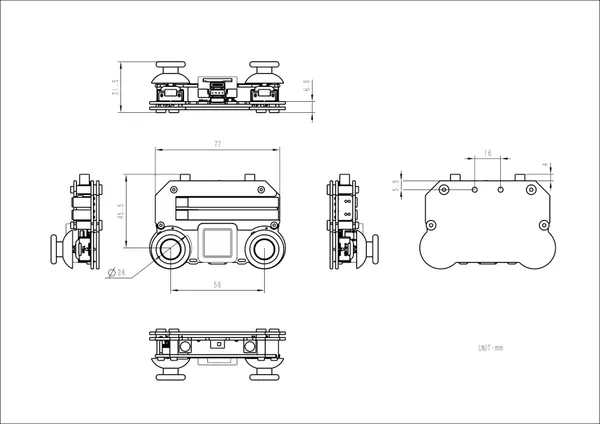

# Atom JoyStick

**M5Stack** · Source collection

Revision: Unverified source identity  
Coverage: Source collection; review pending

[Browse all manufacturers](../../../../BROWSE.md) · [Devices & IoT](../../../../DEVICES.md) · [Open in the browser guide](https://valleytech-black-wire-guide.pages.dev/?board=source-board-7f498022d5cd12274a)

Device category: **Controllers & instruments**

## Dimensions

**source reference** · Unreviewed source · JPG

[Open original reference](../../../../library/media/3744e75e8ee1ecc1bf13233e00f30422703cdd7161e8936ddb3064b59edea188.jpg)

**Credit and rights:** Source rights not yet established. Source/manufacturer: M5Stack.

[Source 1](https://m5stack.oss-cn-shenzhen.aliyuncs.com/resource/docs/products/app/Atom%20JoyStick/%E5%B0%BA%E5%AF%B8%E5%9B%BE.jpg) · [Source 2](https://docs.m5stack.com/en/app/Atom%20JoyStick)

Original source index: Dimensions. This file is searchable but has not been promoted to a reviewed physical board pinout.

Image revision: Not identified

SHA-256: `3744e75e8ee1ecc1bf13233e00f30422703cdd7161e8936ddb3064b59edea188`

Pin assignments have not been independently electrically verified. Check board revision before wiring.
