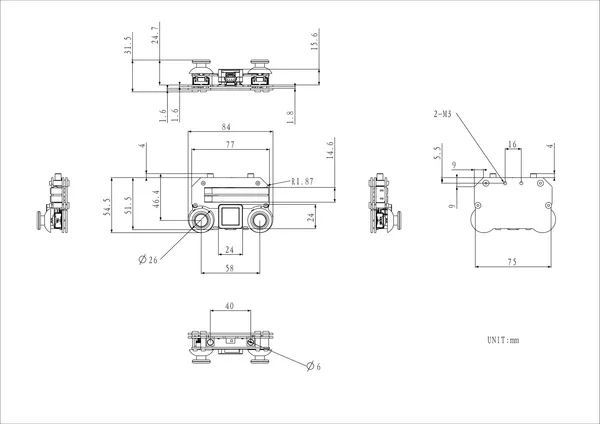

# Atom JoyStick v1.1

**M5Stack** · Source collection

Revision: Unverified source identity  
Coverage: Source collection; review pending

[Browse all manufacturers](../../../../BROWSE.md) · [Devices & IoT](../../../../DEVICES.md) · [Open in the browser guide](https://valleytech-black-wire-guide.pages.dev/?board=source-board-e79956a4c0b01a40b6)

Device category: **Controllers & instruments**

## Dimensions

**source reference** · Unreviewed source · PNG

[Open original reference](../../../../library/media/3d9e126d55ba7e6a848defc18515f03dce99061ab6b55f6524df04117c2a788c.png)

**Credit and rights:** Source rights not yet established. Source/manufacturer: M5Stack.

[Source 1](https://m5stack-doc.oss-cn-shenzhen.aliyuncs.com/1285/K137-V11_Atom_JoyStick_v1.1_model_size_page_01.png) · [Source 2](https://docs.m5stack.com/en/app/Atom_JoyStick_v1.1)

Original source index: Dimensions. This file is searchable but has not been promoted to a reviewed physical board pinout.

Image revision: Not identified

SHA-256: `3d9e126d55ba7e6a848defc18515f03dce99061ab6b55f6524df04117c2a788c`

Pin assignments have not been independently electrically verified. Check board revision before wiring.
