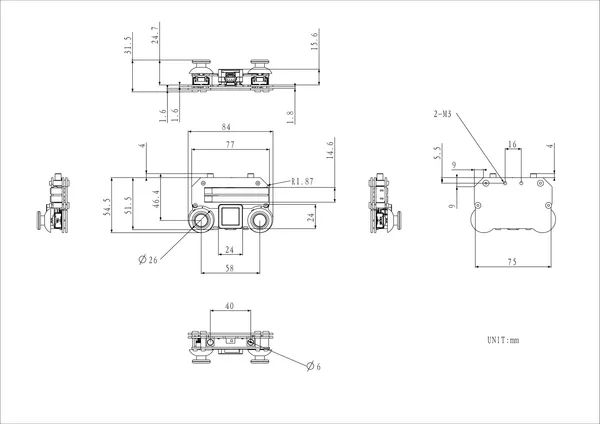
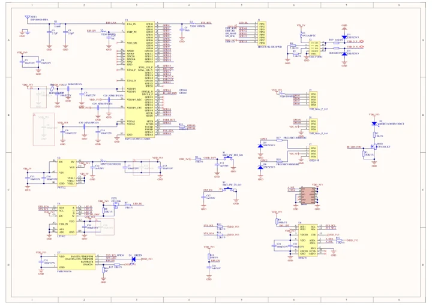

# Atom JoyStick v1.1

**M5Stack** · Source collection

Revision: Unverified source identity

Coverage: Manufacturer references reviewed by scope; independent electrical and all-connector review pending

[Browse all manufacturers](../../../../BROWSE.md) · [Devices & IoT](../../../../DEVICES.md) · [Open in the browser guide](https://valleytech-black-wire-guide.pages.dev/?board=source-board-e79956a4c0b01a40b6)

Device category: **Controllers & instruments**

## Datasheets and original documentation

Board datasheet: **not yet recorded**. Visual reference: **available**.

[Manufacturer hardware documentation](https://docs.m5stack.com/en/app/Atom_JoyStick_v1.1)

- **schematic / recorded-source**: [AtomS3R Schematics PDF](https://m5stack-doc.oss-cn-shenzhen.aliyuncs.com/680/Sch_M5_AtomS3R_v0.4.1.pdf) · [saved document](../../../../library/media/d1a2b292411174fadf8305c57678fbe232cbb51d9a07868251e5984017a814e6.pdf)
- **hardware-guide / board**: [Manufacturer pin and hardware documentation](https://docs.m5stack.com/en/app/Atom_JoyStick_v1.1) · online

A chip datasheet, schematic and board datasheet have different scopes. Match the exact hardware revision.

[Documentation coverage and remaining gaps](../../../../DOCUMENTATION.md)

## Dimensions

**source reference** · Unreviewed source · PNG

[Open original reference](../../../../library/media/3d9e126d55ba7e6a848defc18515f03dce99061ab6b55f6524df04117c2a788c.png)

**Credit and rights:** Source rights not yet established. Source/manufacturer: M5Stack.

[Source 1](https://m5stack-doc.oss-cn-shenzhen.aliyuncs.com/1285/K137-V11_Atom_JoyStick_v1.1_model_size_page_01.png) · [Source 2](https://docs.m5stack.com/en/app/Atom_JoyStick_v1.1)

Original source index: Dimensions. This file is searchable but has not been promoted to a reviewed physical board pinout.

Image revision: Not identified

SHA-256: `3d9e126d55ba7e6a848defc18515f03dce99061ab6b55f6524df04117c2a788c`

## AtomS3R Schematics PDF

**original reference PDF** · Manufacturer source and first-page preview inspected; electrical correctness and all-connector completeness not independently approved. · PDF

[Open original reference](../../../../library/media/d1a2b292411174fadf8305c57678fbe232cbb51d9a07868251e5984017a814e6.pdf)

**Credit and rights:** Manufacturer artwork; reuse and print rights not established. Inclusion does not relicense the original.. Source/manufacturer: M5Stack.

[Source 1](https://m5stack-doc.oss-cn-shenzhen.aliyuncs.com/680/Sch_M5_AtomS3R_v0.4.1.pdf) · [Source 2](https://docs.m5stack.com/en/app/Atom_JoyStick_v1.1)

Manufacturer source retained unchanged. Manufacturer source and first-page preview inspected; electrical correctness and all-connector completeness not independently approved.

Image revision: As supplied in the original; match exact board revision

SHA-256: `d1a2b292411174fadf8305c57678fbe232cbb51d9a07868251e5984017a814e6`

Pin assignments have not been independently electrically verified. Check board revision before wiring.
