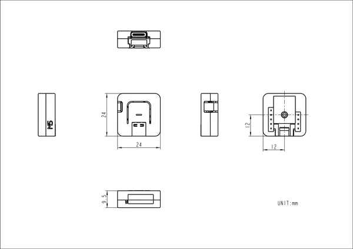

# Atom-Lite

**M5Stack** · Source collection

Revision: Unverified source identity  
Coverage: Source collection; review pending

[Browse all manufacturers](../../../../BROWSE.md) · [Devices & IoT](../../../../DEVICES.md) · [Open in the browser guide](https://valleytech-black-wire-guide.pages.dev/?board=source-board-474ca0108b4acc2297)

Device category: **Controllers & instruments**

## Dimensions

**source reference** · Unreviewed source · PNG

[Open original reference](../../../../library/media/14ba69107f17e22e6f5ca0ffae45c6d6b6e455bacf549a1af1b67a9a7f5c3a80.png)

**Credit and rights:** Source rights not yet established. Source/manufacturer: M5Stack.

[Source 1](https://m5stack.oss-cn-shenzhen.aliyuncs.com/resource/docs/products/core/ATOM%20Lite/model%20size.jpg) · [Source 2](https://docs.m5stack.com/en/core/ATOM%20Lite)

Original source index: Dimensions. This file is searchable but has not been promoted to a reviewed physical board pinout.

Image revision: Not identified

SHA-256: `14ba69107f17e22e6f5ca0ffae45c6d6b6e455bacf549a1af1b67a9a7f5c3a80`

Pin assignments have not been independently electrically verified. Check board revision before wiring.
