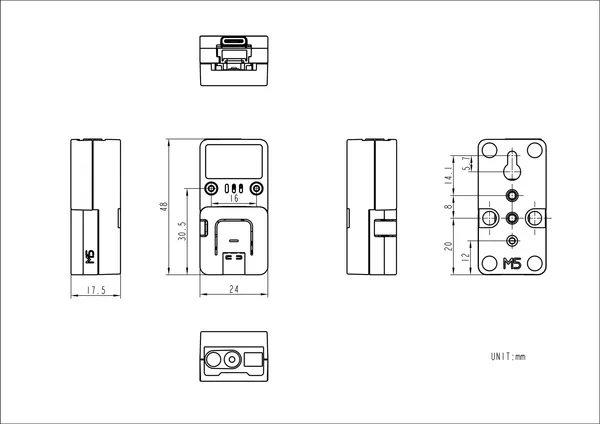

# Atom QRCode v1.1

**M5Stack** · Source collection

Revision: Unverified source identity  
Coverage: Source collection; review pending

[Browse all manufacturers](../../../../BROWSE.md) · [Desktop app](https://github.com/valleytechsolutions/black-wire-desktop)

## Dimensions

**source reference** · Unreviewed source · PNG

[Open original reference](../../../../library/media/30d700356791eca1d2b9bf1f16892ce702507e650d90c4f37738196258cda59b.png)

**Credit and rights:** Source rights not yet established. Source/manufacturer: M5Stack.

[Source 1](https://static-cdn.m5stack.com/resource/docs/products/unit/ATOM QR-CODE Kit/img-0979427e-e51c-4cbe-ab2c-1a1c3c5cad0e.png) · [Source 2](https://docs.m5stack.com/en/atom/ATOM%20QR-CODE%20Kit)

Original source index: Dimensions. This file is searchable but has not been promoted to a reviewed physical board pinout.

SHA-256: `30d700356791eca1d2b9bf1f16892ce702507e650d90c4f37738196258cda59b`

Pin assignments have not been independently electrically verified. Check board revision before wiring.
