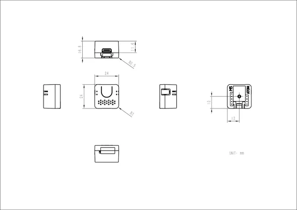

# Atom Voice

**M5Stack** · Source collection

Revision: Unverified source identity  
Coverage: Source collection; review pending

[Browse all manufacturers](../../../../BROWSE.md) · [Devices & IoT](../../../../DEVICES.md) · [Open in the browser guide](https://valleytech-black-wire-guide.pages.dev/?board=source-board-7241298c7f9e0d6a09)

Device category: **Controllers & instruments**

## Dimensions

**source reference** · Unreviewed source · JPG

[Open original reference](../../../../library/media/7c0eaa4f33fd1b5718a41c1e1e3f442e9b8a1250ce9061c3288c0a38472985a7.jpg)

**Credit and rights:** Source rights not yet established. Source/manufacturer: M5Stack.

[Source 1](https://m5stack.oss-cn-shenzhen.aliyuncs.com/resource/docs/products/atom/atomecho/module%20size.jpg) · [Source 2](https://docs.m5stack.com/en/atom/atomecho)

Original source index: Dimensions. This file is searchable but has not been promoted to a reviewed physical board pinout.

Image revision: Not identified

SHA-256: `7c0eaa4f33fd1b5718a41c1e1e3f442e9b8a1250ce9061c3288c0a38472985a7`

Pin assignments have not been independently electrically verified. Check board revision before wiring.
