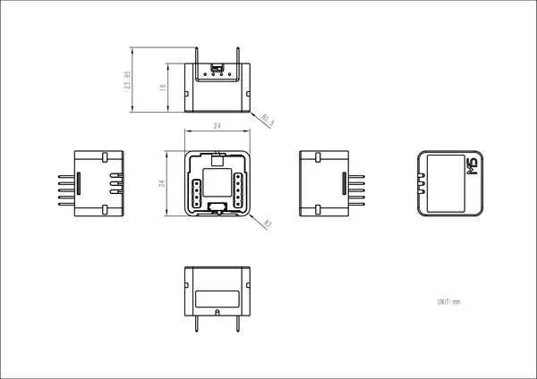

# Atomic Battery Base

**M5Stack** · Source collection

Revision: Unverified source identity  
Coverage: Source collection; review pending

[Browse all manufacturers](../../../../BROWSE.md) · [Desktop app](https://github.com/valleytechsolutions/black-wire-desktop)

## Dimensions

**source reference** · Unreviewed source · PNG

[Open original reference](../../../../library/media/7971bad968b09ba76220ba95cf89a013d260a67095bff831c222f4e2e02885c8.png)

**Credit and rights:** Source rights not yet established. Source/manufacturer: M5Stack.

[Source 1](https://m5stack-doc.oss-cn-shenzhen.aliyuncs.com/1130/A151_Model_Size_page_01.png) · [Source 2](https://docs.m5stack.com/en/atom/Atomic%20Battery%20Base)

Original source index: Dimensions. This file is searchable but has not been promoted to a reviewed physical board pinout.

SHA-256: `7971bad968b09ba76220ba95cf89a013d260a67095bff831c222f4e2e02885c8`

Pin assignments have not been independently electrically verified. Check board revision before wiring.
