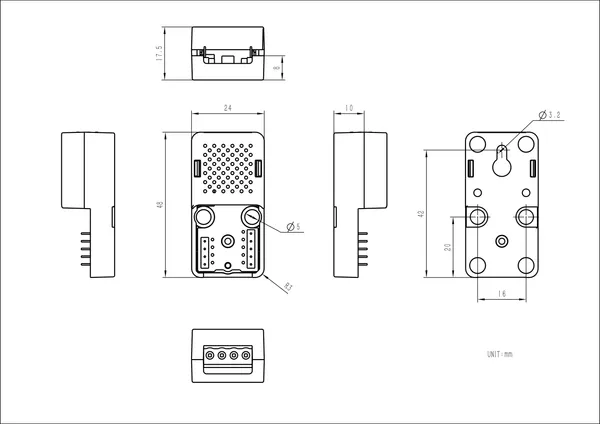

# Atomic CAN Base

**M5Stack** · Source collection

Revision: Unverified source identity  
Coverage: Source collection; review pending

[Browse all manufacturers](../../../../BROWSE.md) · [Devices & IoT](../../../../DEVICES.md) · [Open in the browser guide](https://valleytech-black-wire-guide.pages.dev/?board=source-board-d967181ddc065b5c5b)

Device category: **Controllers & instruments**

## Dimensions

**source reference** · Unreviewed source · PNG

[Open original reference](../../../../library/media/6b1fcb84d50e4e6a36b4ef666e762b90443468591de7f70bfd2758d439c08739.png)

**Credit and rights:** Source rights not yet established. Source/manufacturer: M5Stack.

[Source 1](https://m5stack-doc.oss-cn-shenzhen.aliyuncs.com/931/A092-atom-pwm_page_01.png) · [Source 2](https://docs.m5stack.com/en/atom/Atomic%20CAN%20Base)

Original source index: Dimensions. This file is searchable but has not been promoted to a reviewed physical board pinout.

Image revision: Not identified

SHA-256: `6b1fcb84d50e4e6a36b4ef666e762b90443468591de7f70bfd2758d439c08739`

Pin assignments have not been independently electrically verified. Check board revision before wiring.
