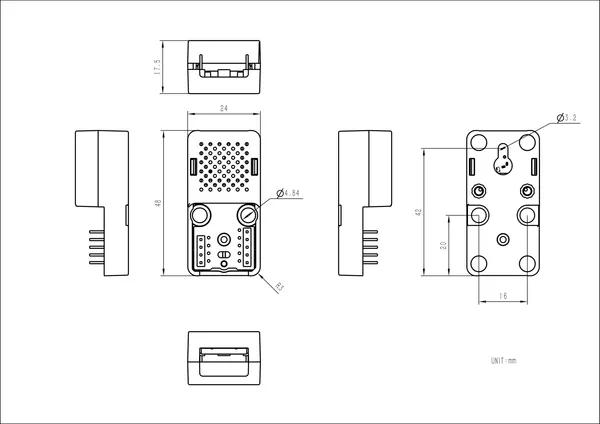

# Atomic GPS Base v2.0

**M5Stack** · Source collection

Revision: Unverified source identity  
Coverage: Source collection; review pending

[Browse all manufacturers](../../../../BROWSE.md) · [Devices & IoT](../../../../DEVICES.md) · [Open in the browser guide](https://valleytech-black-wire-guide.pages.dev/?board=source-board-d8f1456f5c9d5feb9d)

Device category: **Controllers & instruments**

## Dimensions

**source reference** · Unreviewed source · PNG

[Open original reference](../../../../library/media/08b8b041eb3047c1ee23913e233fe91fffb730976009485f8abcdc1d669290a3.png)

**Credit and rights:** Source rights not yet established. Source/manufacturer: M5Stack.

[Source 1](https://m5stack-doc.oss-cn-shenzhen.aliyuncs.com/1158/ATOMGPS-V2_page_01.png) · [Source 2](https://docs.m5stack.com/en/atom/Atomic_GPS_Base_v2.0)

Original source index: Dimensions. This file is searchable but has not been promoted to a reviewed physical board pinout.

Image revision: Not identified

SHA-256: `08b8b041eb3047c1ee23913e233fe91fffb730976009485f8abcdc1d669290a3`

Pin assignments have not been independently electrically verified. Check board revision before wiring.
