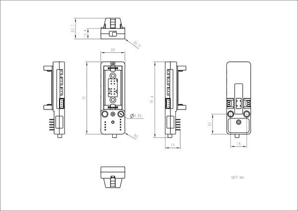

# Atomic Motion Base

**M5Stack** · Source collection

Revision: Unverified source identity  
Coverage: Source collection; review pending

[Browse all manufacturers](../../../../BROWSE.md) · [Devices & IoT](../../../../DEVICES.md) · [Open in the browser guide](https://valleytech-black-wire-guide.pages.dev/?board=source-board-6e44b53e5d49d49550)

Device category: **Controllers & instruments**

## Dimensions

**source reference** · Unreviewed source · JPG

[Open original reference](../../../../library/media/aa89e575f2723295cb4347a76d8654a8c8d6ba7cbc79f4251f1d5f4d17a1f8dc.jpg)

**Credit and rights:** Source rights not yet established. Source/manufacturer: M5Stack.

[Source 1](https://static-cdn.m5stack.com/resource/docs/products/atom/Atomic Motion Base/img-724e1d6d-a17d-43b3-b987-364bbf109ae1.jpg) · [Source 2](https://docs.m5stack.com/en/atom/Atomic%20Motion%20Base)

Original source index: Dimensions. This file is searchable but has not been promoted to a reviewed physical board pinout.

Image revision: Not identified

SHA-256: `aa89e575f2723295cb4347a76d8654a8c8d6ba7cbc79f4251f1d5f4d17a1f8dc`

Pin assignments have not been independently electrically verified. Check board revision before wiring.
