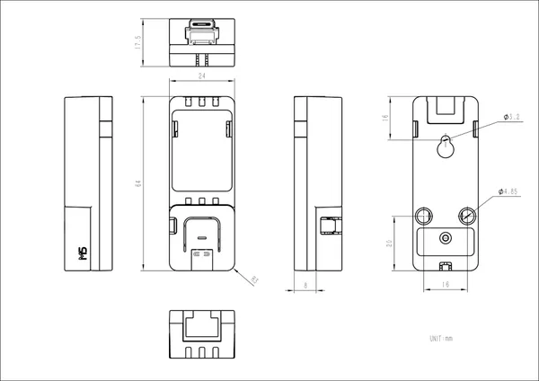

# Atomic PoE Base

**M5Stack** · Source collection

Revision: Unverified source identity  
Coverage: Source collection; review pending

[Browse all manufacturers](../../../../BROWSE.md) · [Devices & IoT](../../../../DEVICES.md) · [Open in the browser guide](https://valleytech-black-wire-guide.pages.dev/?board=source-board-0e99ed6e4a3fa9eed5)

Device category: **Controllers & instruments**

## Dimensions

**source reference** · Unreviewed source · JPG

[Open original reference](../../../../library/media/d80befa4b9499d511a251b13426789f5c895ca7d83ea906aaa95ff29c2d073b7.jpg)

**Credit and rights:** Source rights not yet established. Source/manufacturer: M5Stack.

[Source 1](https://static-cdn.m5stack.com/resource/docs/products/atom/Atomic PoE Base/img-942113e5-3854-45c4-9f45-3ce6a582c57f.jpg) · [Source 2](https://docs.m5stack.com/en/atom/Atomic%20PoE%20Base)

Original source index: Dimensions. This file is searchable but has not been promoted to a reviewed physical board pinout.

Image revision: Not identified

SHA-256: `d80befa4b9499d511a251b13426789f5c895ca7d83ea906aaa95ff29c2d073b7`

Pin assignments have not been independently electrically verified. Check board revision before wiring.
