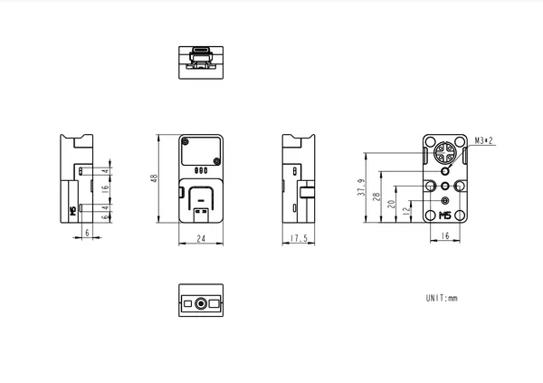

# Atomic QRCode2 Base

**M5Stack** · Source collection

Revision: Unverified source identity  
Coverage: Source collection; review pending

[Browse all manufacturers](../../../../BROWSE.md) · [Desktop app](https://github.com/valleytechsolutions/black-wire-desktop)

## Dimensions

**source reference** · Unreviewed source · PNG

[Open original reference](../../../../library/media/aa7d2f32f80d0685c95895e1c9e52d077697c6f030519279f2e5bf14a9950746.png)

**Credit and rights:** Source rights not yet established. Source/manufacturer: M5Stack.

[Source 1](https://static-cdn.m5stack.com/resource/docs/products/atom/Atomic QRCode2 Base/img-2c572f0f-1ddb-4f41-931d-2c816f3e484b.png) · [Source 2](https://docs.m5stack.com/en/atom/Atomic%20QRCode2%20Base)

Original source index: Dimensions. This file is searchable but has not been promoted to a reviewed physical board pinout.

SHA-256: `aa7d2f32f80d0685c95895e1c9e52d077697c6f030519279f2e5bf14a9950746`

Pin assignments have not been independently electrically verified. Check board revision before wiring.
