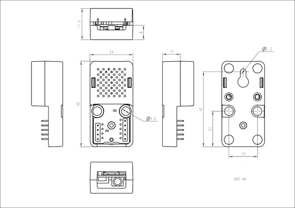

# Atomic SPK Base

**M5Stack** · Source collection

Revision: Unverified source identity  
Coverage: Source collection; review pending

[Browse all manufacturers](../../../../BROWSE.md) · [Desktop app](https://github.com/valleytechsolutions/black-wire-desktop)

## Dimensions

**source reference** · Unreviewed source · JPG

[Open original reference](../../../../library/media/28e5b07e1c5b76202f349bb8379521af97e1e974233aca4563da3575d6df6902.jpg)

**Credit and rights:** Source rights not yet established. Source/manufacturer: M5Stack.

[Source 1](https://static-cdn.m5stack.com/resource/docs/products/atom/Atomic SPK Base/img-456067b7-e4b1-4520-8304-c8f93672c118.jpg) · [Source 2](https://docs.m5stack.com/en/atom/Atomic%20SPK%20Base)

Original source index: Dimensions. This file is searchable but has not been promoted to a reviewed physical board pinout.

SHA-256: `28e5b07e1c5b76202f349bb8379521af97e1e974233aca4563da3575d6df6902`

Pin assignments have not been independently electrically verified. Check board revision before wiring.
