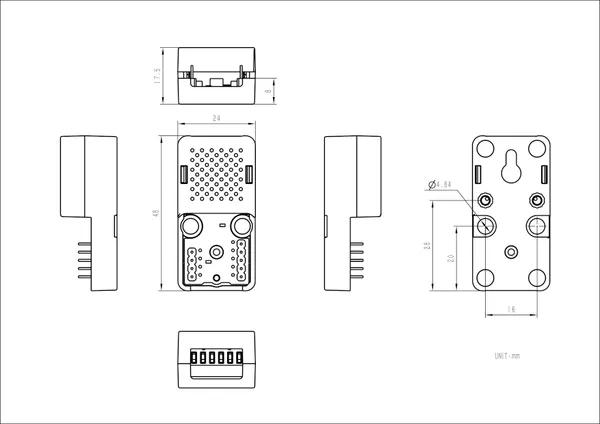

# Atomic Stepmotor Base

**M5Stack** · Source collection

Revision: Unverified source identity  
Coverage: Source collection; review pending

[Browse all manufacturers](../../../../BROWSE.md) · [Desktop app](https://github.com/valleytechsolutions/black-wire-desktop)

## Dimensions

**source reference** · Unreviewed source · JPG

[Open original reference](../../../../library/media/050397c51011c701315ab33e47cfee301b33b7e9e68f2c6057801bb5c39d6816.jpg)

**Credit and rights:** Source rights not yet established. Source/manufacturer: M5Stack.

[Source 1](https://static-cdn.m5stack.com/resource/docs/products/atom/Atomic Stepmotor Base/img-123b7b45-dce4-45a1-abd1-7c6fc60749de.jpg) · [Source 2](https://docs.m5stack.com/en/atom/Atomic%20Stepmotor%20Base)

Original source index: Dimensions. This file is searchable but has not been promoted to a reviewed physical board pinout.

SHA-256: `050397c51011c701315ab33e47cfee301b33b7e9e68f2c6057801bb5c39d6816`

Pin assignments have not been independently electrically verified. Check board revision before wiring.
