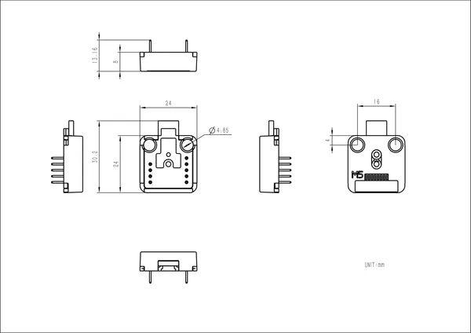

# Atomic ToUnit Base

**M5Stack** · Source collection

Revision: Unverified source identity  
Coverage: Source collection; review pending

[Browse all manufacturers](../../../../BROWSE.md) · [Devices & IoT](../../../../DEVICES.md) · [Open in the browser guide](https://valleytech-black-wire-guide.pages.dev/?board=source-board-4c6dddf9466ba9c6e6)

Device category: **Controllers & instruments**

## Dimensions

**source reference** · Unreviewed source · PNG

[Open original reference](../../../../library/media/b137e5ec9ada82aac59fdd3ac1239e35d39b7021c8c4b4256e4003b7886e8cb1.png)

**Credit and rights:** Source rights not yet established. Source/manufacturer: M5Stack.

[Source 1](https://m5stack-doc.oss-cn-shenzhen.aliyuncs.com/1195/A161-atom2unit_page_01.png) · [Source 2](https://docs.m5stack.com/en/accessory/Atomic_ToUnit_Base)

Original source index: Dimensions. This file is searchable but has not been promoted to a reviewed physical board pinout.

Image revision: Not identified

SHA-256: `b137e5ec9ada82aac59fdd3ac1239e35d39b7021c8c4b4256e4003b7886e8cb1`

Pin assignments have not been independently electrically verified. Check board revision before wiring.
