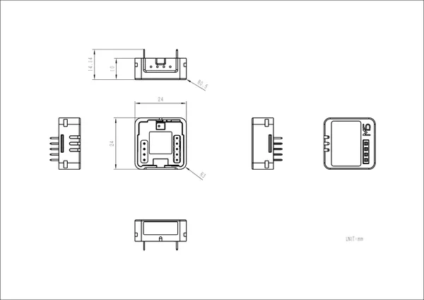

# Atomic Voice Base

**M5Stack** · Source collection

Revision: Unverified source identity  
Coverage: Source collection; review pending

[Browse all manufacturers](../../../../BROWSE.md) · [Desktop app](https://github.com/valleytechsolutions/black-wire-desktop)

## Dimensions

**source reference** · Unreviewed source · JPG

[Open original reference](../../../../library/media/99b82ec0855e80769ee349d2023bc05513aeac31a4d92a4cf3bcc30e03fef806.jpg)

**Credit and rights:** Source rights not yet established. Source/manufacturer: M5Stack.

[Source 1](https://m5stack.oss-cn-shenzhen.aliyuncs.com/resource/docs/products/atom/Atomic%20Echo%20Base/model%20size.jpg) · [Source 2](https://docs.m5stack.com/en/atom/Atomic%20Echo%20Base)

Original source index: Dimensions. This file is searchable but has not been promoted to a reviewed physical board pinout.

SHA-256: `99b82ec0855e80769ee349d2023bc05513aeac31a4d92a4cf3bcc30e03fef806`

Pin assignments have not been independently electrically verified. Check board revision before wiring.
