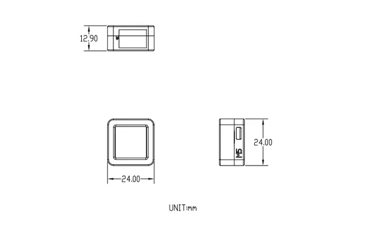

# AtomS3

**M5Stack** · Source collection

Revision: Unverified source identity  
Coverage: Source collection; review pending

[Browse all manufacturers](../../../../BROWSE.md) · [Desktop app](https://github.com/valleytechsolutions/black-wire-desktop)

## Dimensions

**source reference** · Unreviewed source · PNG

[Open original reference](../../../../library/media/0d7391cea6d778a5f2408096c17a929c5464aaaa894e647c243a2913cdc5b82d.png)

**Credit and rights:** Source rights not yet established. Source/manufacturer: M5Stack.

[Source 1](https://static-cdn.m5stack.com/resource/docs/products/core/AtomS3/img-abe8d8b0-3d8c-4f42-a84a-093bfed0aa38.png) · [Source 2](https://docs.m5stack.com/en/core/AtomS3)

Original source index: Dimensions. This file is searchable but has not been promoted to a reviewed physical board pinout.

SHA-256: `0d7391cea6d778a5f2408096c17a929c5464aaaa894e647c243a2913cdc5b82d`

Pin assignments have not been independently electrically verified. Check board revision before wiring.
