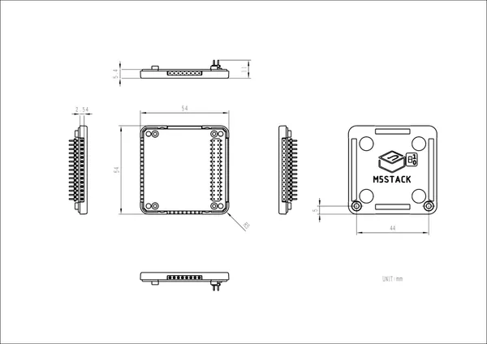

# Base Bottom v1.1

**M5Stack** · Source collection

Revision: Unverified source identity  
Coverage: Source collection; review pending

[Browse all manufacturers](../../../../BROWSE.md) · [Desktop app](https://github.com/valleytechsolutions/black-wire-desktop)

## Dimensions

**source reference** · Unreviewed source · JPG

[Open original reference](../../../../library/media/b7dba99e8d3cfc31842bf4693ed10747e56abae9ba5318bb58e61940e3a025f9.jpg)

**Credit and rights:** Source rights not yet established. Source/manufacturer: M5Stack.

[Source 1](https://static-cdn.m5stack.com/resource/docs/products/module/BLACK-BOTTOM_V1.1/img-2764b984-8228-4cf3-9121-1f7f322a27ac.jpg) · [Source 2](https://docs.m5stack.com/en/base/BLACK-BOTTOM_V1.1)

Original source index: Dimensions. This file is searchable but has not been promoted to a reviewed physical board pinout.

SHA-256: `b7dba99e8d3cfc31842bf4693ed10747e56abae9ba5318bb58e61940e3a025f9`

Pin assignments have not been independently electrically verified. Check board revision before wiring.
