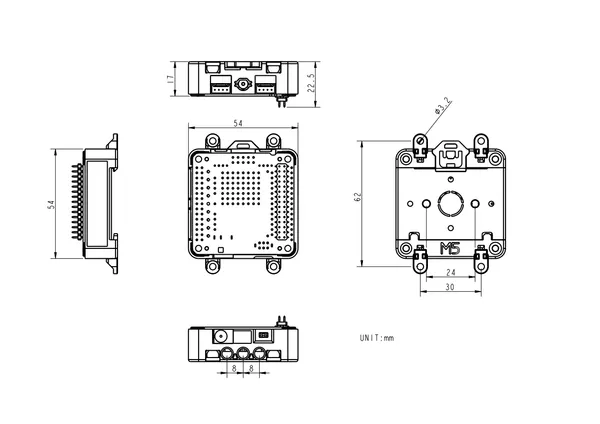

# Base DIN

**M5Stack** · Source collection

Revision: Unverified source identity

Coverage: Source collection; review pending

[Browse all manufacturers](../../../../BROWSE.md) · [Devices & IoT](../../../../DEVICES.md) · [Open in the browser guide](https://valleytech-black-wire-guide.pages.dev/?board=source-board-776cf248a085c91f5b)

## Datasheets and original documentation

Board datasheet: **not yet recorded**. Visual reference: **available**.

[Manufacturer source (recorded link)](https://docs.m5stack.com/en/base/DIN%20BASE)

A chip datasheet, schematic and board datasheet have different scopes. Match the exact hardware revision.

[Documentation coverage and remaining gaps](../../../../DOCUMENTATION.md)

## Dimensions

**source reference** · Unreviewed source · PNG

[Open original reference](../../../../library/media/17c5839192b7e36cbe63a51321ecf4c191a439ce6d6ddc7c1cf182bf756f87d7.png)

**Credit and rights:** Source rights not yet established. Source/manufacturer: M5Stack.

[Source 1](https://m5stack.oss-cn-shenzhen.aliyuncs.com/resource/docs/products/base/DinBase/%E5%B0%BA%E5%AF%B8%E5%9B%BE.png) · [Source 2](https://docs.m5stack.com/en/base/DIN%20BASE)

Original source index: Dimensions. This file is searchable but has not been promoted to a reviewed physical board pinout.

Image revision: Not identified

SHA-256: `17c5839192b7e36cbe63a51321ecf4c191a439ce6d6ddc7c1cf182bf756f87d7`

Pin assignments have not been independently electrically verified. Check board revision before wiring.
