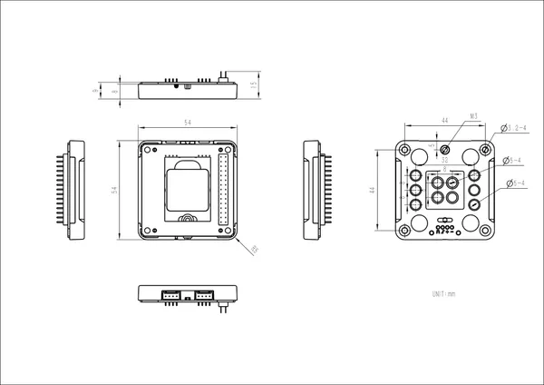

# Base M5GO Bottom

**M5Stack** · Source collection

Revision: Unverified source identity  
Coverage: Source collection; review pending

[Browse all manufacturers](../../../../BROWSE.md) · [Desktop app](https://github.com/valleytechsolutions/black-wire-desktop)

## Dimensions

**source reference** · Unreviewed source · JPG

[Open original reference](../../../../library/media/c12431ceb5ae401eec1cfa53803fbf1e0489291e6c3eb03aa2026ead63bc64b6.jpg)

**Credit and rights:** Source rights not yet established. Source/manufacturer: M5Stack.

[Source 1](https://static-cdn.m5stack.com/resource/docs/products/module/M5GO3 Bottom/img-c2558938-5e94-482b-9c59-02df14bb3088.jpg) · [Source 2](https://docs.m5stack.com/en/base/m5go_bottom)

Original source index: Dimensions. This file is searchable but has not been promoted to a reviewed physical board pinout.

SHA-256: `c12431ceb5ae401eec1cfa53803fbf1e0489291e6c3eb03aa2026ead63bc64b6`

Pin assignments have not been independently electrically verified. Check board revision before wiring.
