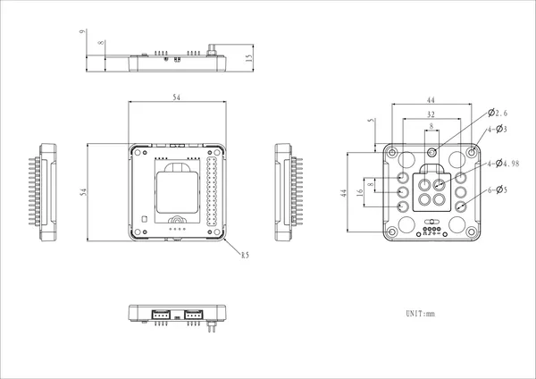
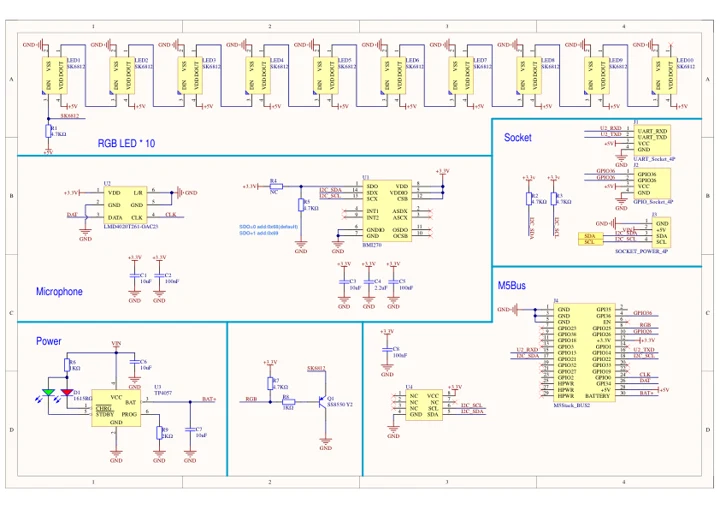

# Base M5GO Bottom2 v1.3

**M5Stack** · Source collection

Revision: Unverified source identity

Coverage: Manufacturer references reviewed by scope; independent electrical and all-connector review pending

[Browse all manufacturers](../../../../BROWSE.md) · [Devices & IoT](../../../../DEVICES.md) · [Open in the browser guide](https://valleytech-black-wire-guide.pages.dev/?board=source-board-f7de86290aace08049)

## Datasheets and original documentation

Board datasheet: **not yet recorded**. Visual reference: **available**.

[Manufacturer hardware documentation](https://docs.m5stack.com/en/base/Base_M5GO_Bottom2_v1.3)

- **schematic / board**: [Base M5GO Bottom2 v1.3 Schematics PDF](https://m5stack-doc.oss-cn-shenzhen.aliyuncs.com/1227/SCH_M5GO-Bottom2_SCH_Main_V1.31_2026_03_16_10_32_04.pdf) · [saved document](../../../../library/media/3763ab7883b2b2b0908c182aeeff385a653fd80707f2d07b1119aa7ddee10e6d.pdf)
- **hardware-guide / board**: [Manufacturer pin and hardware documentation](https://docs.m5stack.com/en/base/Base_M5GO_Bottom2_v1.3) · online

A chip datasheet, schematic and board datasheet have different scopes. Match the exact hardware revision.

[Documentation coverage and remaining gaps](../../../../DOCUMENTATION.md)

## Dimensions

**source reference** · Unreviewed source · PNG

[Open original reference](../../../../library/media/afb95d767fbd7c2d9c66bdbe145055e59f153e651d5e5f5775619a14808a7681.png)

**Credit and rights:** Source rights not yet established. Source/manufacturer: M5Stack.

[Source 1](https://m5stack-doc.oss-cn-shenzhen.aliyuncs.com/1227/A014-C-V13_Base_M5GO_Bottom2_v1.3_model_size_page_01.png) · [Source 2](https://docs.m5stack.com/en/base/Base_M5GO_Bottom2_v1.3)

Original source index: Dimensions. This file is searchable but has not been promoted to a reviewed physical board pinout.

Image revision: Not identified

SHA-256: `afb95d767fbd7c2d9c66bdbe145055e59f153e651d5e5f5775619a14808a7681`

## Base M5GO Bottom2 v1.3 Schematics PDF

**original reference PDF** · Manufacturer source and first-page preview inspected; electrical correctness and all-connector completeness not independently approved. · PDF

[Open original reference](../../../../library/media/3763ab7883b2b2b0908c182aeeff385a653fd80707f2d07b1119aa7ddee10e6d.pdf)

**Credit and rights:** Manufacturer artwork; reuse and print rights not established. Inclusion does not relicense the original.. Source/manufacturer: M5Stack.

[Source 1](https://m5stack-doc.oss-cn-shenzhen.aliyuncs.com/1227/SCH_M5GO-Bottom2_SCH_Main_V1.31_2026_03_16_10_32_04.pdf) · [Source 2](https://docs.m5stack.com/en/base/Base_M5GO_Bottom2_v1.3)

Manufacturer source retained unchanged. Manufacturer source and first-page preview inspected; electrical correctness and all-connector completeness not independently approved.

Image revision: As supplied in the original; match exact board revision

SHA-256: `3763ab7883b2b2b0908c182aeeff385a653fd80707f2d07b1119aa7ddee10e6d`

Pin assignments have not been independently electrically verified. Check board revision before wiring.
