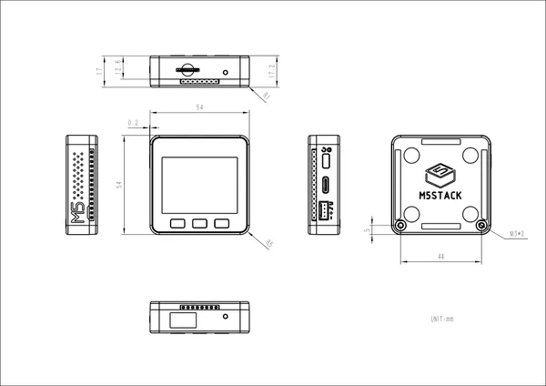

# Basic

**M5Stack** · Source collection

Revision: Unverified source identity  
Coverage: Source collection; review pending

[Browse all manufacturers](../../../../BROWSE.md) · [Desktop app](https://github.com/valleytechsolutions/black-wire-desktop)

## Dimensions

**source reference** · Unreviewed source · JPG

[Open original reference](../../../../library/media/4c2b32834ed6d6c1100b5b390394abed840e780b8cfe5be2c3a4131ad9b7e4e8.jpg)

**Credit and rights:** Source rights not yet established. Source/manufacturer: M5Stack.

[Source 1](https://m5stack.oss-cn-shenzhen.aliyuncs.com/resource/docs/products/core/BASIC%20v2.6/module%20size.jpg) · [Source 2](https://docs.m5stack.com/en/core/basic)

Original source index: Dimensions. This file is searchable but has not been promoted to a reviewed physical board pinout.

SHA-256: `4c2b32834ed6d6c1100b5b390394abed840e780b8cfe5be2c3a4131ad9b7e4e8`

Pin assignments have not been independently electrically verified. Check board revision before wiring.
