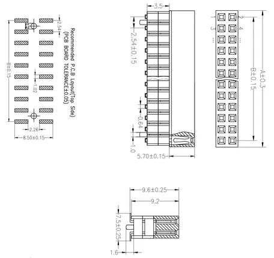

# Bus Socket SMD 13.2

**M5Stack** · Source collection

Revision: Unverified source identity

Coverage: Source collection; review pending

[Browse all manufacturers](../../../../BROWSE.md) · [Devices & IoT](../../../../DEVICES.md) · [Open in the browser guide](https://valleytech-black-wire-guide.pages.dev/?board=source-board-c1836e18c8afadc61f)

## Datasheets and original documentation

Board datasheet: **not yet recorded**. Visual reference: **available**.

[Manufacturer source (recorded link)](https://docs.m5stack.com/en/accessory/bus_socket_smd_13.2)

A chip datasheet, schematic and board datasheet have different scopes. Match the exact hardware revision.

[Documentation coverage and remaining gaps](../../../../DOCUMENTATION.md)

## Dimensions

**source reference** · Unreviewed source · PNG

[Open original reference](../../../../library/media/d73d557cd598505861f3d58e14d47ff7b185835a9ecd92e15772371ae022029f.png)

**Credit and rights:** Source rights not yet established. Source/manufacturer: M5Stack.

[Source 1](https://static-cdn.m5stack.com/resource/docs/products/accessory/bus_socket_smd_13.2/bus_socket_smd_13.2_sch_01.webp) · [Source 2](https://docs.m5stack.com/en/accessory/bus_socket_smd_13.2)

Original source index: Dimensions. This file is searchable but has not been promoted to a reviewed physical board pinout.

Image revision: Not identified

SHA-256: `d73d557cd598505861f3d58e14d47ff7b185835a9ecd92e15772371ae022029f`

Pin assignments have not been independently electrically verified. Check board revision before wiring.
