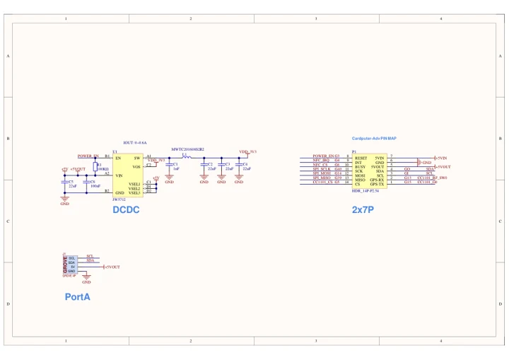

# Cap CC1101

**M5Stack** · Source collection

Revision: Unverified source identity

Coverage: Manufacturer references reviewed by scope; independent electrical and all-connector review pending

[Browse all manufacturers](../../../../BROWSE.md) · [Devices & IoT](../../../../DEVICES.md) · [Open in the browser guide](https://valleytech-black-wire-guide.pages.dev/?board=source-board-c9149fec7e585fb545)

## Datasheets and original documentation

Board datasheet: **not yet recorded**. Visual reference: **available**.

[Manufacturer hardware documentation](https://docs.m5stack.com/en/cap/Cap_CC1101)

- **schematic / board**: [Cap CC1101 Schematic PDF](https://m5stack-doc.oss-cn-shenzhen.aliyuncs.com/1250/SCH_Cap_CC1101_SCH_V0.3_20260528.pdf) · [saved document](../../../../library/media/2c24e78ff5fff44ca2ddb274ad4a514fb736caefb5c8969dacf57f481a965e0b.pdf)
- **hardware-guide / board**: [Manufacturer pin and hardware documentation](https://docs.m5stack.com/en/cap/Cap_CC1101) · online

A chip datasheet, schematic and board datasheet have different scopes. Match the exact hardware revision.

[Documentation coverage and remaining gaps](../../../../DOCUMENTATION.md)

## Dimensions

**source reference** · Unreviewed source · PNG

[Open original reference](../../../../library/media/33843bd35a2f4dde58440c345fc1fa45f100963000a6ae6c5ae9560692d5a060.png)

**Credit and rights:** Source rights not yet established. Source/manufacturer: M5Stack.

[Source 1](https://m5stack-doc.oss-cn-shenzhen.aliyuncs.com/1250/U219_Cap_CC1101_model_size_page_01.png) · [Source 2](https://docs.m5stack.com/en/cap/Cap_CC1101)

Original source index: Dimensions. This file is searchable but has not been promoted to a reviewed physical board pinout.

Image revision: Not identified

SHA-256: `33843bd35a2f4dde58440c345fc1fa45f100963000a6ae6c5ae9560692d5a060`

## Cap CC1101 Schematic PDF

**original reference PDF** · Manufacturer source and first-page preview inspected; electrical correctness and all-connector completeness not independently approved. · PDF

[Open original reference](../../../../library/media/2c24e78ff5fff44ca2ddb274ad4a514fb736caefb5c8969dacf57f481a965e0b.pdf)

**Credit and rights:** Manufacturer artwork; reuse and print rights not established. Inclusion does not relicense the original.. Source/manufacturer: M5Stack.

[Source 1](https://m5stack-doc.oss-cn-shenzhen.aliyuncs.com/1250/SCH_Cap_CC1101_SCH_V0.3_20260528.pdf) · [Source 2](https://docs.m5stack.com/en/cap/Cap_CC1101)

Manufacturer source retained unchanged. Manufacturer source and first-page preview inspected; electrical correctness and all-connector completeness not independently approved.

Image revision: As supplied in the original; match exact board revision

SHA-256: `2c24e78ff5fff44ca2ddb274ad4a514fb736caefb5c8969dacf57f481a965e0b`

Pin assignments have not been independently electrically verified. Check board revision before wiring.
