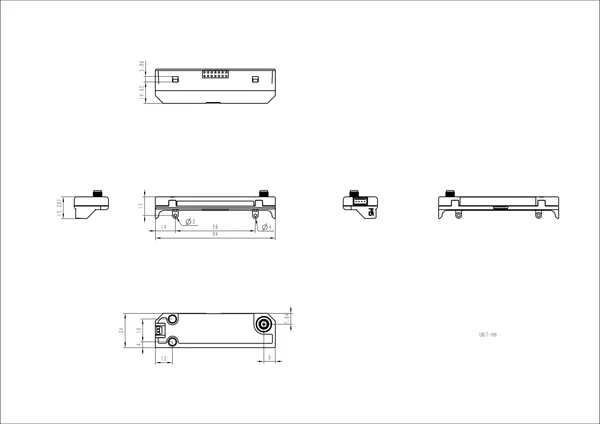

# Cap LoRa-1262

**M5Stack** · Source collection

Revision: Unverified source identity  
Coverage: Source collection; review pending

[Browse all manufacturers](../../../../BROWSE.md) · [Desktop app](https://github.com/valleytechsolutions/black-wire-desktop)

## Dimensions

**source reference** · Unreviewed source · PNG

[Open original reference](../../../../library/media/06f743759b7a4c7e7e114a311ed91b24f301528d99732bb0e8f1ca733d5f9d67.png)

**Credit and rights:** Source rights not yet established. Source/manufacturer: M5Stack.

[Source 1](https://m5stack-doc.oss-cn-shenzhen.aliyuncs.com/1208/U214-00-cap1262-model-size_page_01.png) · [Source 2](https://docs.m5stack.com/en/cap/Cap_LoRa-1262)

Original source index: Dimensions. This file is searchable but has not been promoted to a reviewed physical board pinout.

SHA-256: `06f743759b7a4c7e7e114a311ed91b24f301528d99732bb0e8f1ca733d5f9d67`

Pin assignments have not been independently electrically verified. Check board revision before wiring.
