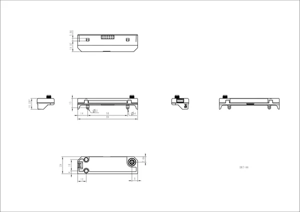

# Cap LoRa-1262

**M5Stack** · Source collection

Revision: Unverified source identity

Coverage: Manufacturer references reviewed by scope; independent electrical and all-connector review pending

[Browse all manufacturers](../../../../BROWSE.md) · [Devices & IoT](../../../../DEVICES.md) · [Open in the browser guide](https://valleytech-black-wire-guide.pages.dev/?board=source-board-58b723a0e6d0c4f9f5)

## Datasheets and original documentation

Board datasheet: **not yet recorded**. Visual reference: **available**.

[Manufacturer hardware documentation](https://docs.m5stack.com/en/cap/Cap_LoRa-1262)

- **schematic / recorded-source**: [Stamp LoRa-1262 Mini Schematics PDF](https://m5stack-doc.oss-cn-shenzhen.aliyuncs.com/1208/NEW-1262-SCH_A1-Lora_2025_08_27_10_58_52.pdf) · [saved document](../../../../library/media/6ec29a9240fc8dc41fbe699e74a9f645b9753d7932efc1de28b049fe58e8f03b.pdf)
- **hardware-guide / board**: [Manufacturer pin and hardware documentation](https://docs.m5stack.com/en/cap/Cap_LoRa-1262) · online

A chip datasheet, schematic and board datasheet have different scopes. Match the exact hardware revision.

[Documentation coverage and remaining gaps](../../../../DOCUMENTATION.md)

## Dimensions

**source reference** · Unreviewed source · PNG

[Open original reference](../../../../library/media/06f743759b7a4c7e7e114a311ed91b24f301528d99732bb0e8f1ca733d5f9d67.png)

**Credit and rights:** Source rights not yet established. Source/manufacturer: M5Stack.

[Source 1](https://m5stack-doc.oss-cn-shenzhen.aliyuncs.com/1208/U214-00-cap1262-model-size_page_01.png) · [Source 2](https://docs.m5stack.com/en/cap/Cap_LoRa-1262)

Original source index: Dimensions. This file is searchable but has not been promoted to a reviewed physical board pinout.

Image revision: Not identified

SHA-256: `06f743759b7a4c7e7e114a311ed91b24f301528d99732bb0e8f1ca733d5f9d67`

## Stamp LoRa-1262 Mini Schematics PDF

**original reference PDF** · Source identity and visual scope inspected; PDF review covers first-page preview. Independent electrical and all-connector completeness review pending. · PDF

[Open original reference](../../../../library/media/6ec29a9240fc8dc41fbe699e74a9f645b9753d7932efc1de28b049fe58e8f03b.pdf)

**Credit and rights:** Manufacturer artwork; reuse and print rights not established. Inclusion does not relicense the original.. Source/manufacturer: M5Stack.

[Source 1](https://m5stack-doc.oss-cn-shenzhen.aliyuncs.com/1208/NEW-1262-SCH_A1-Lora_2025_08_27_10_58_52.pdf) · [Source 2](https://docs.m5stack.com/en/cap/Cap_LoRa-1262)

Manufacturer source retained unchanged. Source identity and visual scope inspected; PDF review covers first-page preview. Independent electrical and all-connector completeness review pending.

Image revision: As supplied in the original; match exact board revision

SHA-256: `6ec29a9240fc8dc41fbe699e74a9f645b9753d7932efc1de28b049fe58e8f03b`

Pin assignments have not been independently electrically verified. Check board revision before wiring.
